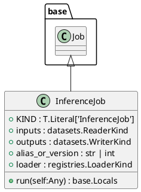
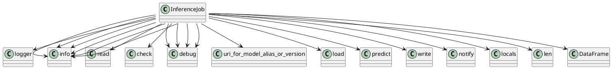

# Module: `src/regression_model_template/jobs/inference.py`

## Overview
**Purpose**: Define a job for generating batch predictions from a registered model.

**Architecture Role**: Domain Models

**Dependencies**:
- `pydantic`
- `regression_model_template.core`
- `typing`
- `regression_model_template.jobs`
- `pandas`
- `regression_model_template.io`

**Exported Symbols**:
- `InferenceJob`

## UML Class Diagram

## Call Graph

## Classes
### Class `InferenceJob`
**Overview**: Generate batch predictions from a registered model.

Parameters:
    inputs (datasets.ReaderKind): reader for the inputs data.
    outputs (datasets.WriterKind): writer for the outputs data.
    alias_or_version (str | int): alias or version for the  model.
    loader (registries.LoaderKind): registry loader for the model.

#### Attributes
- `KIND`: T.Literal['InferenceJob']
- `inputs`: datasets.ReaderKind
- `outputs`: datasets.WriterKind
- `alias_or_version`: str | int
- `loader`: registries.LoaderKind
#### Public Methods
##### `run`
- **Description**: No description available.
- **Inputs**:
  - `self`: Any
- **Output**: `base.Locals`
- **Side Effects**: Not documented
- **Complexity**: Not documented

#### Private Methods
## Functions
