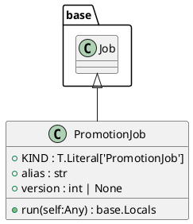
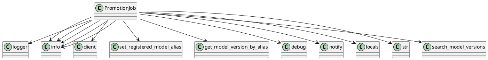

# Module: `src/regression_model_template/jobs/promotion.py`

## Overview
**Purpose**: Define a job for promoting a registered model version with an alias.

**Architecture Role**: Domain Models

**Dependencies**:
- `typing`
- `regression_model_template.jobs`

**Exported Symbols**:
- `PromotionJob`

## UML Class Diagram

## Call Graph

## Classes
### Class `PromotionJob`
**Overview**: Define a job for promoting a registered model version with an alias.

https://mlflow.org/docs/latest/model-registry.html#concepts

Parameters:
    alias (str): the mlflow alias to transition the registered model version.
    version (int | None): the model version to transition (use None for latest).

#### Attributes
- `KIND`: T.Literal['PromotionJob']
- `alias`: str
- `version`: int | None
#### Public Methods
##### `run`
- **Description**: No description available.
- **Inputs**:
  - `self`: Any
- **Output**: `base.Locals`
- **Side Effects**: Not documented
- **Complexity**: Not documented

#### Private Methods
## Functions
