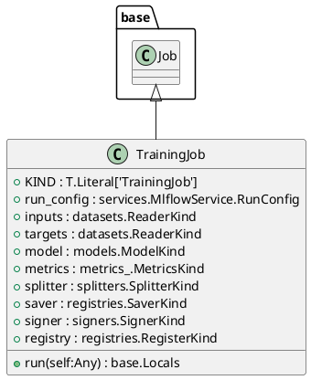

# Module: `src/regression_model_template/jobs/training.py`

## Overview
**Purpose**: Define a job for training and registring a single AI/ML model.

**Architecture Role**: Domain Models

**Dependencies**:
- `pydantic`
- `typing`
- `regression_model_template.utils`
- `mlflow`
- `mlflow.entities`
- `regression_model_template.jobs`
- `regression_model_template.core`
- `regression_model_template.io`
- `time`

**Exported Symbols**:
- `TrainingJob`

## UML Class Diagram

## Call Graph

```plantuml
@startuml
TrainingJob::run --> logger
TrainingJob::run --> info
TrainingJob::run --> client
TrainingJob::run --> info
TrainingJob::run --> locals
TrainingJob::run --> run_context
TrainingJob::run --> info
TrainingJob::run --> info
TrainingJob::run --> read
TrainingJob::run --> check
TrainingJob::run --> debug
TrainingJob::run --> info
TrainingJob::run --> read
TrainingJob::run --> check
TrainingJob::run --> debug
TrainingJob::run --> info
TrainingJob::run --> lineage
TrainingJob::run --> log_input
TrainingJob::run --> debug
TrainingJob::run --> info
TrainingJob::run --> lineage
TrainingJob::run --> log_input
TrainingJob::run --> debug
TrainingJob::run --> info
TrainingJob::run --> next
TrainingJob::run --> debug
TrainingJob::run --> debug
TrainingJob::run --> debug
TrainingJob::run --> debug
TrainingJob::run --> info
TrainingJob::run --> fit
TrainingJob::run --> info
TrainingJob::run --> predict
TrainingJob::run --> debug
TrainingJob::run --> enumerate
TrainingJob::run --> len
TrainingJob::run --> log_batch
TrainingJob::run --> info
TrainingJob::run --> sign
TrainingJob::run --> debug
TrainingJob::run --> info
TrainingJob::run --> save
TrainingJob::run --> debug
TrainingJob::run --> info
TrainingJob::run --> register
TrainingJob::run --> debug
TrainingJob::run --> notify
TrainingJob::run --> to_dict
TrainingJob::run --> to_dict
TrainingJob::run --> split
TrainingJob::run --> len
TrainingJob::run --> info
TrainingJob::run --> score
TrainingJob::run --> debug
TrainingJob::run --> to_dict
TrainingJob::run --> head
TrainingJob::run --> head
TrainingJob::run --> head
TrainingJob::run --> Metric
TrainingJob::run --> items
TrainingJob::run --> int
TrainingJob::run --> time
@enduml
```

## Classes
### Class `TrainingJob`
**Overview**: Train and register a single AI/ML model.

Parameters:
    run_config (services.MlflowService.RunConfig): mlflow run config.
    inputs (datasets.ReaderKind): reader for the inputs data.
    targets (datasets.ReaderKind): reader for the targets data.
    model (models.ModelKind): machine learning model to train.
    metrics (metrics_.MetricKind): metrics for the reporting.
    splitter (splitters.SplitterKind): data sets splitter.
    saver (registries.SaverKind): model saver.
    signer (signers.SignerKind): model signer.
    registry (registries.RegisterKind): model register.

#### Attributes
- `KIND`: T.Literal['TrainingJob']
- `run_config`: services.MlflowService.RunConfig
- `inputs`: datasets.ReaderKind
- `targets`: datasets.ReaderKind
- `model`: models.ModelKind
- `metrics`: metrics_.MetricsKind
- `splitter`: splitters.SplitterKind
- `saver`: registries.SaverKind
- `signer`: signers.SignerKind
- `registry`: registries.RegisterKind
#### Public Methods
##### `run`
- **Description**: No description available.
- **Inputs**:
  - `self`: Any
- **Output**: `base.Locals`
- **Side Effects**: Not documented
- **Complexity**: Not documented

#### Private Methods
## Functions
