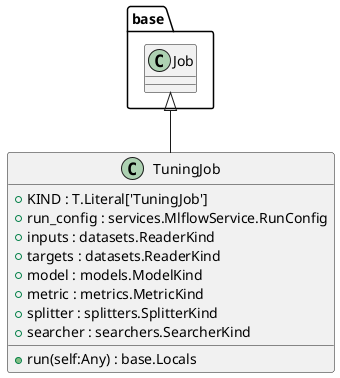
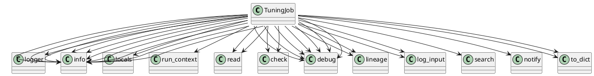

# Module: `src/regression_model_template/jobs/tuning.py`

## Overview
**Purpose**: Define a job for finding the best hyperparameters for a model.

**Architecture Role**: Domain Models

**Dependencies**:
- `pydantic`
- `typing`
- `mlflow`
- `regression_model_template.jobs`
- `regression_model_template.core`
- `regression_model_template.io`
- `regression_model_template.utils`

**Exported Symbols**:
- `TuningJob`

## UML Class Diagram

## Call Graph

## Classes
### Class `TuningJob`
**Overview**: Find the best hyperparameters for a model.

Parameters:
    run_config (services.MlflowService.RunConfig): mlflow run config.
    inputs (datasets.ReaderKind): reader for the inputs data.
    targets (datasets.ReaderKind): reader for the targets data.
    model (models.ModelKind): machine learning model to tune.
    metric (metrics.MetricKind): tuning metric to optimize.
    splitter (splitters.SplitterKind): data sets splitter.
    searcher: (searchers.SearcherKind): hparams searcher.

#### Attributes
- `KIND`: T.Literal['TuningJob']
- `run_config`: services.MlflowService.RunConfig
- `inputs`: datasets.ReaderKind
- `targets`: datasets.ReaderKind
- `model`: models.ModelKind
- `metric`: metrics.MetricKind
- `splitter`: splitters.SplitterKind
- `searcher`: searchers.SearcherKind
#### Public Methods
##### `run`
- **Description**: Run the tuning job in context.
- **Inputs**:
  - `self`: Any
- **Output**: `base.Locals`
- **Side Effects**: Not documented
- **Complexity**: Not documented

#### Private Methods
## Functions
