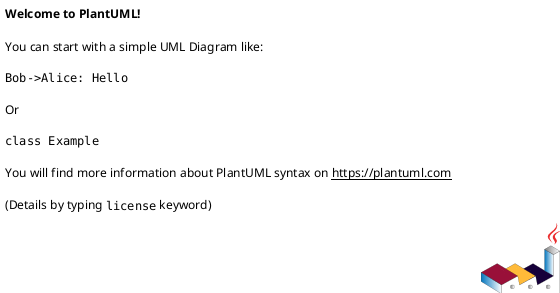
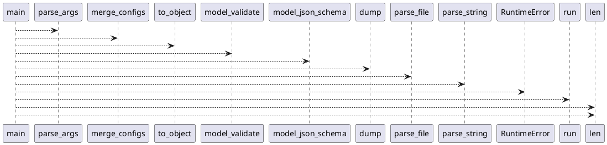

# Module: `src/regression_model_template/scripts.py`

## Overview
**Purpose**: Scripts for the CLI application.

**Architecture Role**: Domain Models

**Dependencies**:
- `sys`
- `json`
- `warnings`
- `regression_model_template`
- `regression_model_template.io`
- `argparse`

**Exported Symbols**:
- `main`

## UML Class Diagram

## Call Graph

## Classes
## Functions
### Function `main`
- **Description**: Main script for the application.
- **Inputs**:
  - `argv`: list[str] | None
- **Output**: `int`
- **Side Effects**: Not documented
- **Complexity**: Not documented
