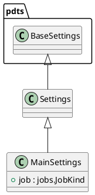
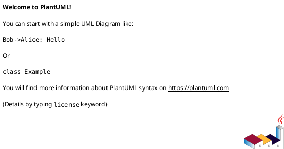

# Module: `src/regression_model_template/settings.py`

## Overview
**Purpose**: Define settings for the application.

**Architecture Role**: Domain Models

**Dependencies**:
- `pydantic`
- `regression_model_template`
- `pydantic_settings`

**Exported Symbols**:
- `Settings`
- `MainSettings`

## UML Class Diagram

## Call Graph

## Classes
### Class `Settings`
**Overview**: Base class for application settings.

Use settings to provide high-level preferences.
i.e., to separate settings from provider (e.g., CLI).

#### Public Methods
#### Private Methods
### Class `MainSettings`
**Overview**: Main settings of the application.

Parameters:
    job (jobs.JobKind): job to run.

#### Attributes
- `job`: jobs.JobKind
#### Public Methods
#### Private Methods
## Functions
