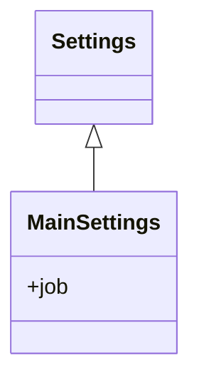
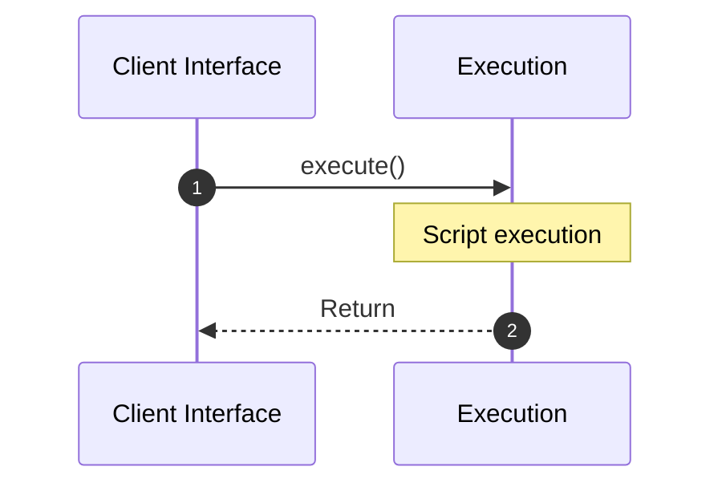
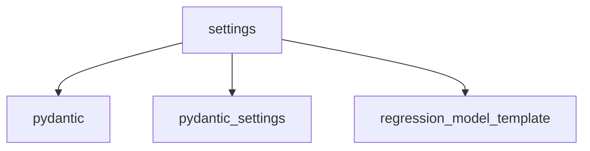

# Module Name: settings

Source File: `src/regression_model_template/settings.py`
* **Source Directory Reference:** `src/regression_model_template/`
* **Package Dependency:** Upstream: `pydantic_settings`, `pydantic`, `regression_model_template` | Downstream: None

## 1. Executive Summary & Purpose
Deterministic architectural model extracted via AST parsing for module `settings`.

## 2. UML 2.0 Class & Inheritance Architecture (Deterministic)
The following class diagram models the object-oriented structure, explicit inheritance hierarchies, and polymorphic interface implementations derived from local AST analysis:

## 3. Package & Class Relations

The following diagram defines the package boundaries and directional inter-package dependencies:

* **Inheritance & Polymorphism:** Detailed breakdown of abstract base classes, interfaces, and concrete overrides.
* **Dependencies:** How classes within this package collaborate externally.

## 4. Execution Flow & Runtime Behavior

The following sequence diagram outlines the execution lifecycle and message passing during core operations:

---

* **Source Citations:**
  - Class `Settings`: `src/regression_model_template/settings.py:13`
  - Class `MainSettings`: `src/regression_model_template/settings.py:21`

