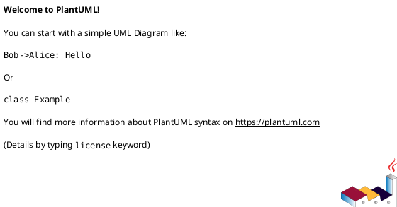

# Module: `src/regression_model_template/utils/__init__.py`

## Overview
**Purpose**: Helper components of the project.

**Architecture Role**: Domain Models

**Dependencies**:

**Exported Symbols**:

## UML Class Diagram

## Call Graph

## Classes
## Functions
