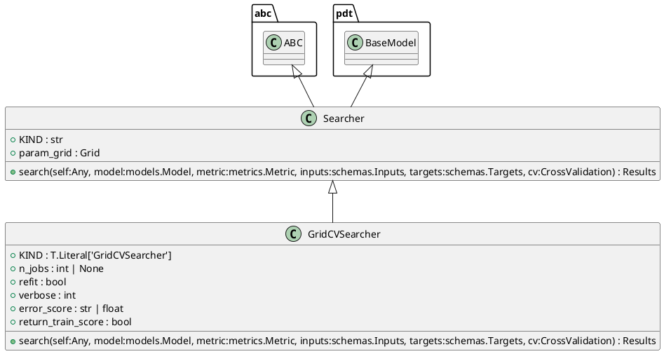
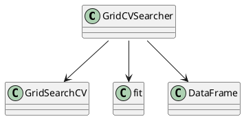

# Module: `src/regression_model_template/utils/searchers.py`

## Overview
**Purpose**: Find the best hyperparameters for a model.

**Architecture Role**: Domain Models

**Dependencies**:
- `sklearn`
- `pydantic`
- `regression_model_template.core`
- `typing`
- `abc`
- `pandas`
- `regression_model_template.utils`

**Exported Symbols**:
- `Searcher`
- `GridCVSearcher`

## UML Class Diagram

## Call Graph

## Classes
### Class `Searcher`
**Overview**: Base class for a searcher.

Use searcher to fine-tune models.
i.e., to find the best model params.

Parameters:
    param_grid (Grid): mapping of param key -> values.

#### Attributes
- `KIND`: str
- `param_grid`: Grid
#### Public Methods
##### `search`
- **Description**: Search the best model for the given inputs and targets.

Args:
    model (models.Model): AI/ML model to fine-tune.
    metric (metrics.Metric): main metric to optimize.
    inputs (schemas.Inputs): model inputs for tuning.
    targets (schemas.Targets): model targets for tuning.
    cv (CrossValidation): choice for cross-fold validation.

Returns:
    Results: all the results of the searcher execution process.
- **Inputs**:
  - `self`: Any
  - `model`: models.Model
  - `metric`: metrics.Metric
  - `inputs`: schemas.Inputs
  - `targets`: schemas.Targets
  - `cv`: CrossValidation
- **Output**: `Results`
- **Side Effects**: Not documented
- **Complexity**: Not documented

#### Private Methods
### Class `GridCVSearcher`
**Overview**: Grid searcher with cross-fold validation.

Convention: metric returns higher values for better models.

Parameters:
    n_jobs (int, optional): number of jobs to run in parallel.
    refit (bool): refit the model after the tuning.
    verbose (int): set the searcher verbosity level.
    error_score (str | float): strategy or value on error.
    return_train_score (bool): include train scores if True.

#### Attributes
- `KIND`: T.Literal['GridCVSearcher']
- `n_jobs`: int | None
- `refit`: bool
- `verbose`: int
- `error_score`: str | float
- `return_train_score`: bool
#### Public Methods
##### `search`
- **Description**: No description available.
- **Inputs**:
  - `self`: Any
  - `model`: models.Model
  - `metric`: metrics.Metric
  - `inputs`: schemas.Inputs
  - `targets`: schemas.Targets
  - `cv`: CrossValidation
- **Output**: `Results`
- **Side Effects**: Not documented
- **Complexity**: Not documented

#### Private Methods
## Functions
