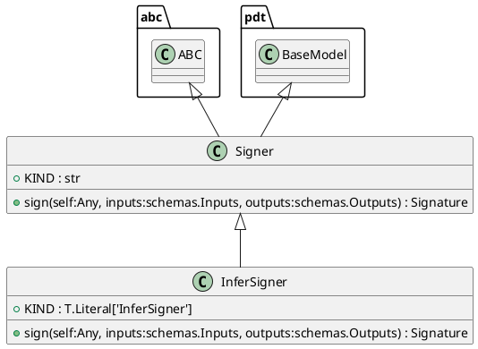
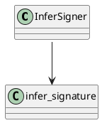

# Module: `src/regression_model_template/utils/signers.py`

## Overview
**Purpose**: Generate signatures for AI/ML models.

**Architecture Role**: Domain Models

**Dependencies**:
- `pydantic`
- `typing`
- `mlflow.models`
- `abc`
- `mlflow`
- `regression_model_template.core`

**Exported Symbols**:
- `Signer`
- `InferSigner`

## UML Class Diagram

## Call Graph

## Classes
### Class `Signer`
**Overview**: Base class for generating model signatures.

Allow to switch between model signing strategies.
e.g., automatic inference, manual model signature, ...

https://mlflow.org/docs/latest/models.html#model-signature-and-input-example

#### Attributes
- `KIND`: str
#### Public Methods
##### `sign`
- **Description**: Generate a model signature from its inputs/outputs.

Args:
    inputs (schemas.Inputs): inputs data.
    outputs (schemas.Outputs): outputs data.

Returns:
    Signature: signature of the model.
- **Inputs**:
  - `self`: Any
  - `inputs`: schemas.Inputs
  - `outputs`: schemas.Outputs
- **Output**: `Signature`
- **Side Effects**: Not documented
- **Complexity**: Not documented

#### Private Methods
### Class `InferSigner`
**Overview**: Generate model signatures from inputs/outputs data.

#### Attributes
- `KIND`: T.Literal['InferSigner']
#### Public Methods
##### `sign`
- **Description**: No description available.
- **Inputs**:
  - `self`: Any
  - `inputs`: schemas.Inputs
  - `outputs`: schemas.Outputs
- **Output**: `Signature`
- **Side Effects**: Not documented
- **Complexity**: Not documented

#### Private Methods
## Functions
