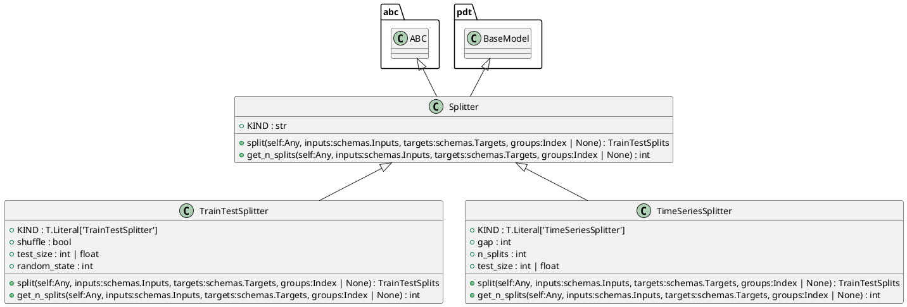
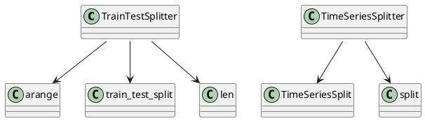

# Module: `src/regression_model_template/utils/splitters.py`

## Overview
**Purpose**: Split dataframes into subsets (e.g., train/valid/test).

**Architecture Role**: Domain Models

**Dependencies**:
- `sklearn`
- `pydantic`
- `numpy`
- `typing`
- `abc`
- `numpy.typing`
- `regression_model_template.core`

**Exported Symbols**:
- `Splitter`
- `TrainTestSplitter`
- `TimeSeriesSplitter`

## UML Class Diagram

## Call Graph

## Classes
### Class `Splitter`
**Overview**: Base class for a splitter.

Use splitters to split data in sets.
e.g., split between a train/test subsets.

# https://scikit-learn.org/stable/glossary.html#term-CV-splitter

#### Attributes
- `KIND`: str
#### Public Methods
##### `split`
- **Description**: Split a dataframe into subsets.

Args:
    inputs (schemas.Inputs): model inputs.
    targets (schemas.Targets): model targets.
    groups (Index | None, optional): group labels.

Returns:
    TrainTestSplits: iterator over the dataframe train/test splits.
- **Inputs**:
  - `self`: Any
  - `inputs`: schemas.Inputs
  - `targets`: schemas.Targets
  - `groups`: Index | None
- **Output**: `TrainTestSplits`
- **Side Effects**: Not documented
- **Complexity**: Not documented

##### `get_n_splits`
- **Description**: Get the number of splits generated.

Args:
    inputs (schemas.Inputs): models inputs.
    targets (schemas.Targets): model targets.
    groups (Index | None, optional): group labels.

Returns:
    int: number of splits generated.
- **Inputs**:
  - `self`: Any
  - `inputs`: schemas.Inputs
  - `targets`: schemas.Targets
  - `groups`: Index | None
- **Output**: `int`
- **Side Effects**: Not documented
- **Complexity**: Not documented

#### Private Methods
### Class `TrainTestSplitter`
**Overview**: Split a dataframe into a train and test set.

Parameters:
    shuffle (bool): shuffle the dataset. Default is False.
    test_size (int | float): number/ratio for the test set.
    random_state (int): random state for the splitter object.

#### Attributes
- `KIND`: T.Literal['TrainTestSplitter']
- `shuffle`: bool
- `test_size`: int | float
- `random_state`: int
#### Public Methods
##### `split`
- **Description**: No description available.
- **Inputs**:
  - `self`: Any
  - `inputs`: schemas.Inputs
  - `targets`: schemas.Targets
  - `groups`: Index | None
- **Output**: `TrainTestSplits`
- **Side Effects**: Not documented
- **Complexity**: Not documented

##### `get_n_splits`
- **Description**: No description available.
- **Inputs**:
  - `self`: Any
  - `inputs`: schemas.Inputs
  - `targets`: schemas.Targets
  - `groups`: Index | None
- **Output**: `int`
- **Side Effects**: Not documented
- **Complexity**: Not documented

#### Private Methods
### Class `TimeSeriesSplitter`
**Overview**: Split a dataframe into fixed time series subsets.

Parameters:
    gap (int): gap between splits.
    n_splits (int): number of split to generate.
    test_size (int | float): number or ratio for the test dataset.

#### Attributes
- `KIND`: T.Literal['TimeSeriesSplitter']
- `gap`: int
- `n_splits`: int
- `test_size`: int | float
#### Public Methods
##### `split`
- **Description**: No description available.
- **Inputs**:
  - `self`: Any
  - `inputs`: schemas.Inputs
  - `targets`: schemas.Targets
  - `groups`: Index | None
- **Output**: `TrainTestSplits`
- **Side Effects**: Not documented
- **Complexity**: Not documented

##### `get_n_splits`
- **Description**: No description available.
- **Inputs**:
  - `self`: Any
  - `inputs`: schemas.Inputs
  - `targets`: schemas.Targets
  - `groups`: Index | None
- **Output**: `int`
- **Side Effects**: Not documented
- **Complexity**: Not documented

#### Private Methods
## Functions
