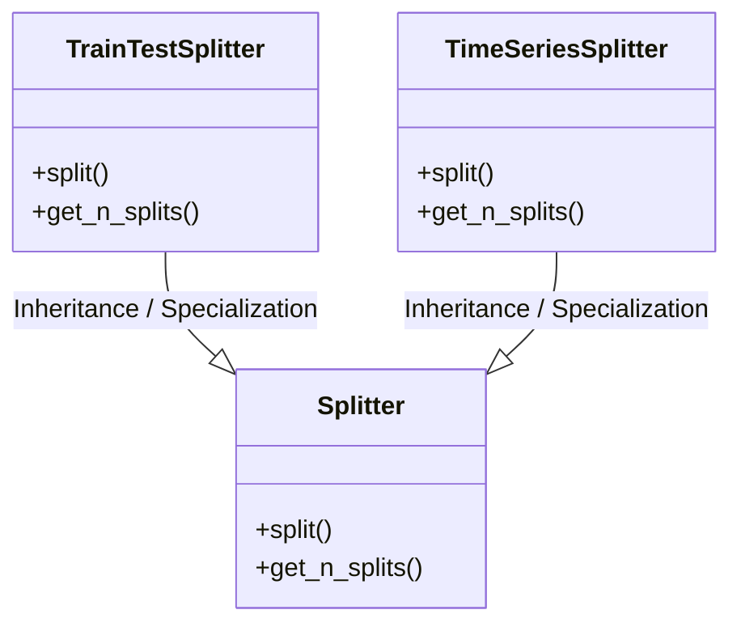
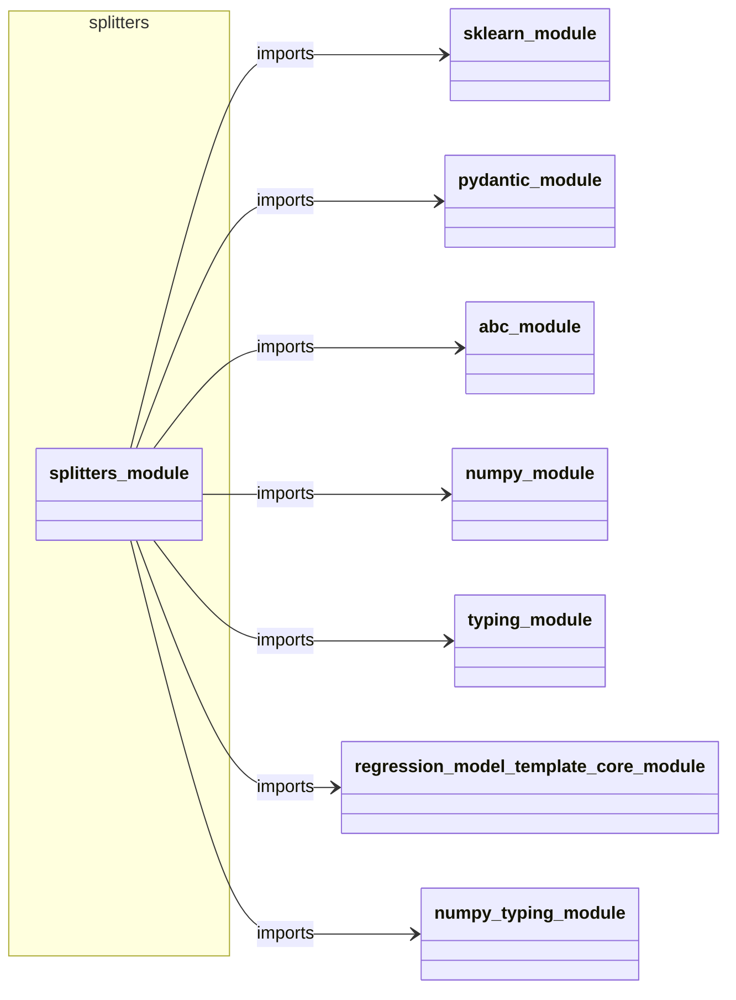
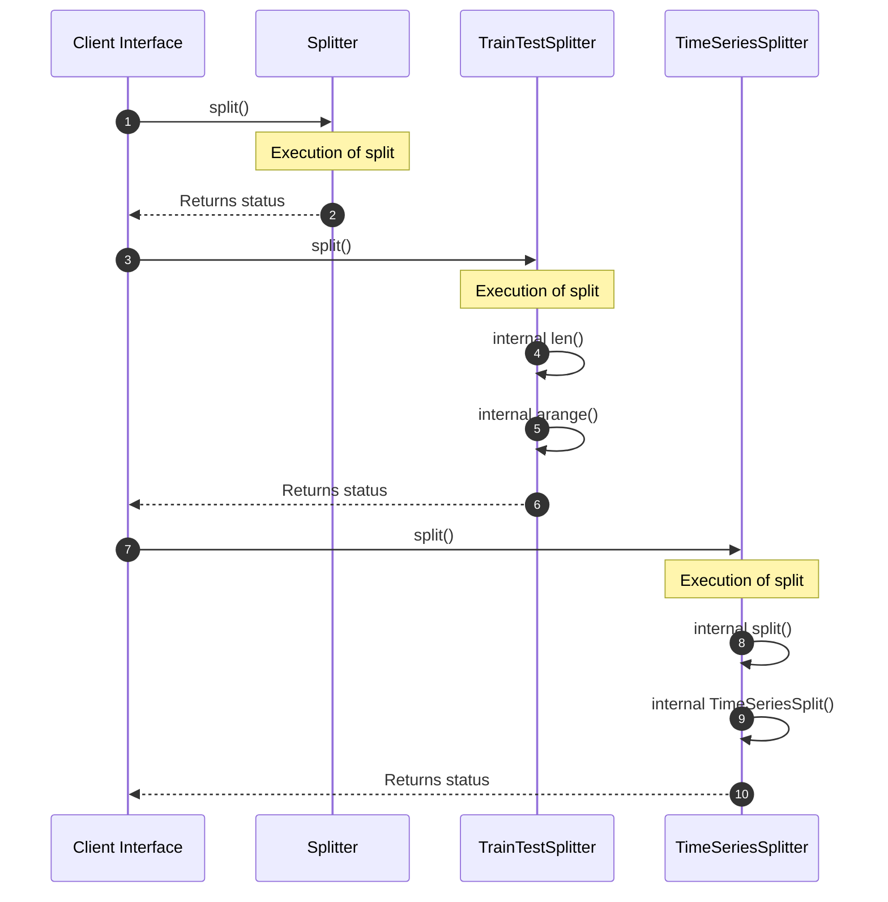

# Module Name: splitters

* **Source Directory Reference:** `src/regression_model_template/utils/`
* **Package Dependency:** Upstream: `sklearn`, `pydantic`, `abc`, `numpy`, `typing`, `regression_model_template.core`, `numpy.typing` | Downstream: None

## 1. Executive Summary & Purpose
Deterministic architectural model extracted via AST parsing for module `splitters`.

## 2. UML 2.0 Class & Inheritance Architecture (Deterministic)
The following class diagram models the object-oriented structure, explicit inheritance hierarchies, and polymorphic interface implementations derived from local AST analysis:

## 3. Package & Class Relations

The following diagram defines the package boundaries and directional inter-package dependencies:

* **Inheritance & Polymorphism:** Detailed breakdown of abstract base classes, interfaces, and concrete overrides.
* **Dependencies:** How classes within this package collaborate externally.

## 4. Execution Flow & Runtime Behavior

The following sequence diagram outlines the execution lifecycle and message passing during core operations:

---

* **Source Citations:**
  - Class `Splitter`: `src/regression_model_template/utils/splitters.py:24`
  - Method `split`: `src/regression_model_template/utils/splitters.py:36`
  - Method `get_n_splits`: `src/regression_model_template/utils/splitters.py:49`
  - Class `TrainTestSplitter`: `src/regression_model_template/utils/splitters.py:62`
  - Method `split`: `src/regression_model_template/utils/splitters.py:77`
  - Method `get_n_splits`: `src/regression_model_template/utils/splitters.py:84`
  - Class `TimeSeriesSplitter`: `src/regression_model_template/utils/splitters.py:88`
  - Method `split`: `src/regression_model_template/utils/splitters.py:103`
  - Method `get_n_splits`: `src/regression_model_template/utils/splitters.py:107`
