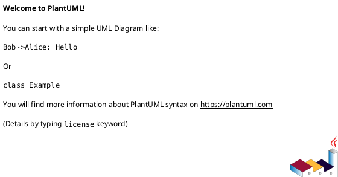

# Module: `tasks/__init__.py`

## Overview
**Purpose**: Task collections for the project.

**Architecture Role**: Infrastructure

**Dependencies**:
- `invoke`

**Exported Symbols**:

## UML Class Diagram

## Call Graph

## Classes
## Functions
