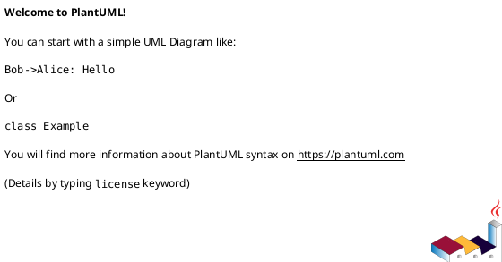
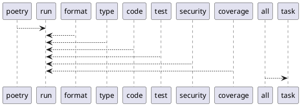

# Module: `tasks/checks.py`

## Overview
**Purpose**: Check tasks for pyinvoke.

**Architecture Role**: Infrastructure

**Dependencies**:
- `invoke.tasks`
- `invoke.context`

**Exported Symbols**:
- `poetry`
- `format`
- `type`
- `code`
- `test`
- `security`
- `coverage`
- `all`

## UML Class Diagram

## Call Graph

## Classes
## Functions
### Function `poetry`
- **Description**: Check poetry config files.
- **Inputs**:
  - `ctx`: Context
- **Output**: `None`
- **Side Effects**: Not documented
- **Complexity**: Not documented

### Function `format`
- **Description**: Check the formats with ruff.
- **Inputs**:
  - `ctx`: Context
- **Output**: `None`
- **Side Effects**: Not documented
- **Complexity**: Not documented

### Function `type`
- **Description**: Check the types with mypy.
- **Inputs**:
  - `ctx`: Context
- **Output**: `None`
- **Side Effects**: Not documented
- **Complexity**: Not documented

### Function `code`
- **Description**: Check the codes with ruff.
- **Inputs**:
  - `ctx`: Context
- **Output**: `None`
- **Side Effects**: Not documented
- **Complexity**: Not documented

### Function `test`
- **Description**: Check the tests with pytest.
- **Inputs**:
  - `ctx`: Context
- **Output**: `None`
- **Side Effects**: Not documented
- **Complexity**: Not documented

### Function `security`
- **Description**: Check the security with bandit.
- **Inputs**:
  - `ctx`: Context
- **Output**: `None`
- **Side Effects**: Not documented
- **Complexity**: Not documented

### Function `coverage`
- **Description**: Check the coverage with coverage.
- **Inputs**:
  - `ctx`: Context
- **Output**: `None`
- **Side Effects**: Not documented
- **Complexity**: Not documented

### Function `all`
- **Description**: Run all check tasks.
- **Inputs**:
  - `_`: Context
- **Output**: `None`
- **Side Effects**: Not documented
- **Complexity**: Not documented
