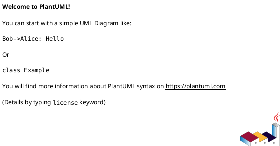
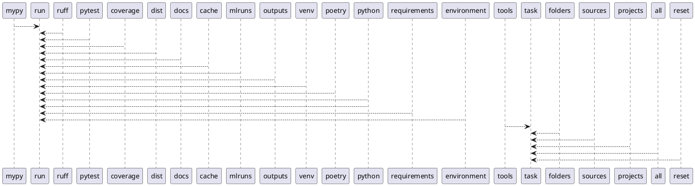

# Module: `tasks/cleans.py`

## Overview
**Purpose**: Clean tasks for pyinvoke.

**Architecture Role**: Infrastructure

**Dependencies**:
- `invoke.tasks`
- `invoke.context`

**Exported Symbols**:
- `mypy`
- `ruff`
- `pytest`
- `coverage`
- `dist`
- `docs`
- `cache`
- `mlruns`
- `outputs`
- `venv`
- `poetry`
- `python`
- `requirements`
- `environment`
- `tools`
- `folders`
- `sources`
- `projects`
- `all`
- `reset`

## UML Class Diagram

## Call Graph

## Classes
## Functions
### Function `mypy`
- **Description**: Clean the mypy tool.
- **Inputs**:
  - `ctx`: Context
- **Output**: `None`
- **Side Effects**: Not documented
- **Complexity**: Not documented

### Function `ruff`
- **Description**: Clean the ruff tool.
- **Inputs**:
  - `ctx`: Context
- **Output**: `None`
- **Side Effects**: Not documented
- **Complexity**: Not documented

### Function `pytest`
- **Description**: Clean the pytest tool.
- **Inputs**:
  - `ctx`: Context
- **Output**: `None`
- **Side Effects**: Not documented
- **Complexity**: Not documented

### Function `coverage`
- **Description**: Clean the coverage tool.
- **Inputs**:
  - `ctx`: Context
- **Output**: `None`
- **Side Effects**: Not documented
- **Complexity**: Not documented

### Function `dist`
- **Description**: Clean the dist folder.
- **Inputs**:
  - `ctx`: Context
- **Output**: `None`
- **Side Effects**: Not documented
- **Complexity**: Not documented

### Function `docs`
- **Description**: Clean the docs folder.
- **Inputs**:
  - `ctx`: Context
- **Output**: `None`
- **Side Effects**: Not documented
- **Complexity**: Not documented

### Function `cache`
- **Description**: Clean the cache folder.
- **Inputs**:
  - `ctx`: Context
- **Output**: `None`
- **Side Effects**: Not documented
- **Complexity**: Not documented

### Function `mlruns`
- **Description**: Clean the mlruns folder.
- **Inputs**:
  - `ctx`: Context
- **Output**: `None`
- **Side Effects**: Not documented
- **Complexity**: Not documented

### Function `outputs`
- **Description**: Clean the outputs folder.
- **Inputs**:
  - `ctx`: Context
- **Output**: `None`
- **Side Effects**: Not documented
- **Complexity**: Not documented

### Function `venv`
- **Description**: Clean the venv folder.
- **Inputs**:
  - `ctx`: Context
- **Output**: `None`
- **Side Effects**: Not documented
- **Complexity**: Not documented

### Function `poetry`
- **Description**: Clean poetry lock file.
- **Inputs**:
  - `ctx`: Context
- **Output**: `None`
- **Side Effects**: Not documented
- **Complexity**: Not documented

### Function `python`
- **Description**: Clean python caches and bytecodes.
- **Inputs**:
  - `ctx`: Context
- **Output**: `None`
- **Side Effects**: Not documented
- **Complexity**: Not documented

### Function `requirements`
- **Description**: Clean the project requirements file.
- **Inputs**:
  - `ctx`: Context
- **Output**: `None`
- **Side Effects**: Not documented
- **Complexity**: Not documented

### Function `environment`
- **Description**: Clean the project environment file.
- **Inputs**:
  - `ctx`: Context
- **Output**: `None`
- **Side Effects**: Not documented
- **Complexity**: Not documented

### Function `tools`
- **Description**: Run all tools tasks.
- **Inputs**:
  - `_`: Context
- **Output**: `None`
- **Side Effects**: Not documented
- **Complexity**: Not documented

### Function `folders`
- **Description**: Run all folders tasks.
- **Inputs**:
  - `_`: Context
- **Output**: `None`
- **Side Effects**: Not documented
- **Complexity**: Not documented

### Function `sources`
- **Description**: Run all sources tasks.
- **Inputs**:
  - `_`: Context
- **Output**: `None`
- **Side Effects**: Not documented
- **Complexity**: Not documented

### Function `projects`
- **Description**: Run all projects tasks.
- **Inputs**:
  - `_`: Context
- **Output**: `None`
- **Side Effects**: Not documented
- **Complexity**: Not documented

### Function `all`
- **Description**: Run all tools and folders tasks.
- **Inputs**:
  - `_`: Context
- **Output**: `None`
- **Side Effects**: Not documented
- **Complexity**: Not documented

### Function `reset`
- **Description**: Run all tools, folders, sources, and projects tasks.
- **Inputs**:
  - `_`: Context
- **Output**: `None`
- **Side Effects**: Not documented
- **Complexity**: Not documented
