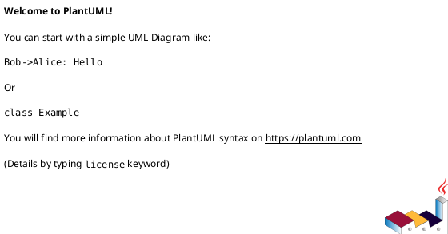
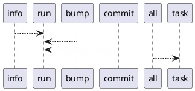

# Module: `tasks/commits.py`

## Overview
**Purpose**: Commits tasks for pyinvoke.

**Architecture Role**: Infrastructure

**Dependencies**:
- `invoke.tasks`
- `invoke.context`

**Exported Symbols**:
- `info`
- `bump`
- `commit`
- `all`

## UML Class Diagram

## Call Graph

## Classes
## Functions
### Function `info`
- **Description**: Print a guide for messages.
- **Inputs**:
  - `ctx`: Context
- **Output**: `None`
- **Side Effects**: Not documented
- **Complexity**: Not documented

### Function `bump`
- **Description**: Bump the version of the package.
- **Inputs**:
  - `ctx`: Context
- **Output**: `None`
- **Side Effects**: Not documented
- **Complexity**: Not documented

### Function `commit`
- **Description**: Commit all changes with a message.
- **Inputs**:
  - `ctx`: Context
- **Output**: `None`
- **Side Effects**: Not documented
- **Complexity**: Not documented

### Function `all`
- **Description**: Run all commit tasks.
- **Inputs**:
  - `_`: Context
- **Output**: `None`
- **Side Effects**: Not documented
- **Complexity**: Not documented
