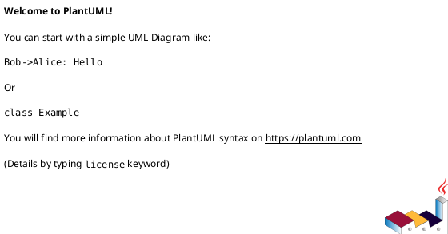
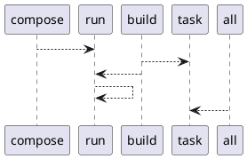

# Module: `tasks/containers.py`

## Overview
**Purpose**: Container tasks for pyinvoke.

**Architecture Role**: Infrastructure

**Dependencies**:
- `invoke.tasks`
- `invoke.context`

**Exported Symbols**:
- `compose`
- `build`
- `run`
- `all`

## UML Class Diagram

## Call Graph

## Classes
## Functions
### Function `compose`
- **Description**: Start up docker compose.
- **Inputs**:
  - `ctx`: Context
- **Output**: `None`
- **Side Effects**: Not documented
- **Complexity**: Not documented

### Function `build`
- **Description**: Build the container image.
- **Inputs**:
  - `ctx`: Context
  - `tag`: str
- **Output**: `None`
- **Side Effects**: Not documented
- **Complexity**: Not documented

### Function `run`
- **Description**: Run the container image.
- **Inputs**:
  - `ctx`: Context
  - `tag`: str
- **Output**: `None`
- **Side Effects**: Not documented
- **Complexity**: Not documented

### Function `all`
- **Description**: Run all container tasks.
- **Inputs**:
  - `_`: Context
- **Output**: `None`
- **Side Effects**: Not documented
- **Complexity**: Not documented
