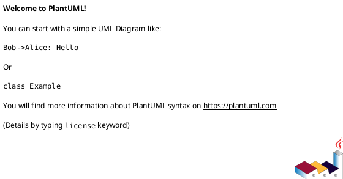
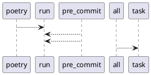

# Module: `tasks/installs.py`

## Overview
**Purpose**: Install tasks for pyinvoke.

**Architecture Role**: Infrastructure

**Dependencies**:
- `invoke.tasks`
- `invoke.context`

**Exported Symbols**:
- `poetry`
- `pre_commit`
- `all`

## UML Class Diagram

## Call Graph

## Classes
## Functions
### Function `poetry`
- **Description**: Install poetry packages.
- **Inputs**:
  - `ctx`: Context
- **Output**: `None`
- **Side Effects**: Not documented
- **Complexity**: Not documented

### Function `pre_commit`
- **Description**: Install pre-commit hooks on git.
- **Inputs**:
  - `ctx`: Context
- **Output**: `None`
- **Side Effects**: Not documented
- **Complexity**: Not documented

### Function `all`
- **Description**: Run all install tasks.
- **Inputs**:
  - `_`: Context
- **Output**: `None`
- **Side Effects**: Not documented
- **Complexity**: Not documented
