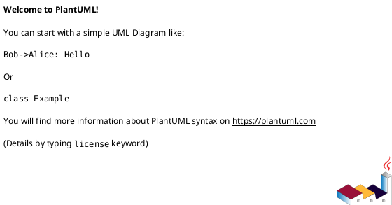
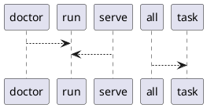

# Module: `tasks/mlflow.py`

## Overview
**Purpose**: Mlflow tasks for pyinvoke.

**Architecture Role**: Infrastructure

**Dependencies**:
- `invoke.tasks`
- `invoke.context`

**Exported Symbols**:
- `doctor`
- `serve`
- `all`

## UML Class Diagram

## Call Graph

## Classes
## Functions
### Function `doctor`
- **Description**: Run mlflow doctor.
- **Inputs**:
  - `ctx`: Context
- **Output**: `None`
- **Side Effects**: Not documented
- **Complexity**: Not documented

### Function `serve`
- **Description**: Start the mlflow server.
- **Inputs**:
  - `ctx`: Context
  - `host`: str
  - `port`: str
  - `backend_uri`: str
- **Output**: `None`
- **Side Effects**: Not documented
- **Complexity**: Not documented

### Function `all`
- **Description**: Run all mlflow tasks.
- **Inputs**:
  - `_`: Context
- **Output**: `None`
- **Side Effects**: Not documented
- **Complexity**: Not documented
