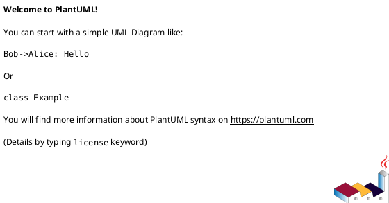
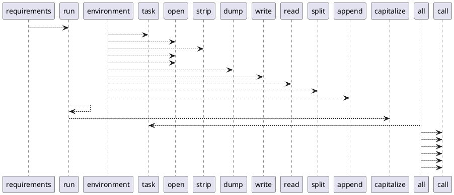

# Module: `tasks/projects.py`

## Overview
**Purpose**: Project tasks for pyinvoke.

**Architecture Role**: Infrastructure

**Dependencies**:
- `json`
- `invoke.context`
- `invoke.tasks`

**Exported Symbols**:
- `requirements`
- `environment`
- `run`
- `all`

## UML Class Diagram

## Call Graph

## Classes
## Functions
### Function `requirements`
- **Description**: Export the project requirements file.
- **Inputs**:
  - `ctx`: Context
- **Output**: `None`
- **Side Effects**: Not documented
- **Complexity**: Not documented

### Function `environment`
- **Description**: Export the project environment file.
- **Inputs**:
  - `ctx`: Context
- **Output**: `None`
- **Side Effects**: Not documented
- **Complexity**: Not documented

### Function `run`
- **Description**: Run an mlflow project from the MLproject file.
- **Inputs**:
  - `ctx`: Context
  - `job`: str
- **Output**: `None`
- **Side Effects**: Not documented
- **Complexity**: Not documented

### Function `all`
- **Description**: Run all project tasks.
- **Inputs**:
  - `_`: Context
- **Output**: `None`
- **Side Effects**: Not documented
- **Complexity**: Not documented
