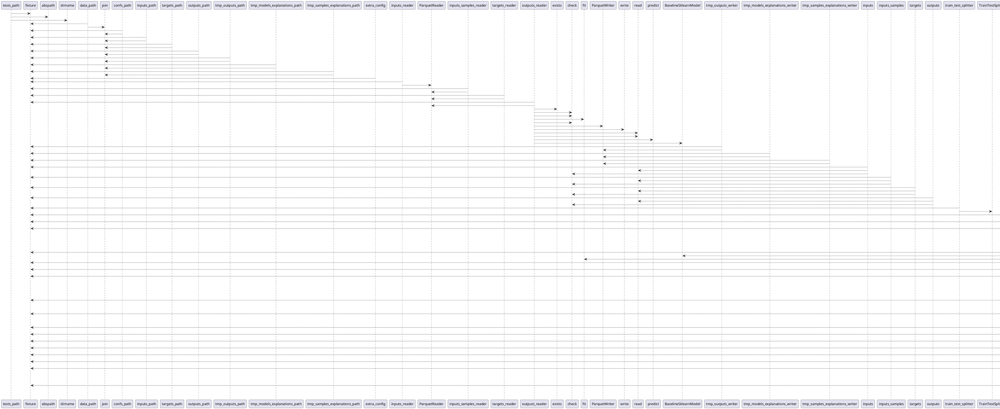

# Module: `tests/conftest.py`

## Overview
**Purpose**: Configuration for the tests.

**Architecture Role**: Infrastructure

**Dependencies**:
- `regression_model_template.core`
- `typing`
- `regression_model_template.io`
- `omegaconf`
- `pytest`
- `_pytest`
- `os`
- `regression_model_template.utils`

**Exported Symbols**:
- `tests_path`
- `data_path`
- `confs_path`
- `inputs_path`
- `targets_path`
- `outputs_path`
- `tmp_outputs_path`
- `tmp_models_explanations_path`
- `tmp_samples_explanations_path`
- `extra_config`
- `inputs_reader`
- `inputs_samples_reader`
- `targets_reader`
- `outputs_reader`
- `tmp_outputs_writer`
- `tmp_models_explanations_writer`
- `tmp_samples_explanations_writer`
- `inputs`
- `inputs_samples`
- `targets`
- `outputs`
- `train_test_splitter`
- `time_series_splitter`
- `searcher`
- `train_test_sets`
- `model`
- `metric`
- `signer`
- `logger_service`
- `logger_caplog`
- `alerts_service`
- `mlflow_service`
- `tests_path_resolver`
- `tmp_path_resolver`
- `signature`
- `saver`
- `loader`
- `register`
- `model_version`
- `model_alias`

## UML Class Diagram

## Call Graph

## Classes
## Functions
### Function `tests_path`
- **Description**: Return the path of the tests folder.
- **Inputs**:
- **Output**: `str`
- **Side Effects**: Not documented
- **Complexity**: Not documented

### Function `data_path`
- **Description**: Return the path of the data folder.
- **Inputs**:
  - `tests_path`: str
- **Output**: `str`
- **Side Effects**: Not documented
- **Complexity**: Not documented

### Function `confs_path`
- **Description**: Return the path of the confs folder.
- **Inputs**:
  - `tests_path`: str
- **Output**: `str`
- **Side Effects**: Not documented
- **Complexity**: Not documented

### Function `inputs_path`
- **Description**: Return the path of the inputs dataset.
- **Inputs**:
  - `data_path`: str
- **Output**: `str`
- **Side Effects**: Not documented
- **Complexity**: Not documented

### Function `targets_path`
- **Description**: Return the path of the targets dataset.
- **Inputs**:
  - `data_path`: str
- **Output**: `str`
- **Side Effects**: Not documented
- **Complexity**: Not documented

### Function `outputs_path`
- **Description**: Return the path of the outputs dataset.
- **Inputs**:
  - `data_path`: str
- **Output**: `str`
- **Side Effects**: Not documented
- **Complexity**: Not documented

### Function `tmp_outputs_path`
- **Description**: Return a tmp path for the outputs dataset.
- **Inputs**:
  - `tmp_path`: str
- **Output**: `str`
- **Side Effects**: Not documented
- **Complexity**: Not documented

### Function `tmp_models_explanations_path`
- **Description**: Return a tmp path for the model explanations dataset.
- **Inputs**:
  - `tmp_path`: str
- **Output**: `str`
- **Side Effects**: Not documented
- **Complexity**: Not documented

### Function `tmp_samples_explanations_path`
- **Description**: Return a tmp path for the samples explanations dataset.
- **Inputs**:
  - `tmp_path`: str
- **Output**: `str`
- **Side Effects**: Not documented
- **Complexity**: Not documented

### Function `extra_config`
- **Description**: Extra config for scripts.
- **Inputs**:
- **Output**: `str`
- **Side Effects**: Not documented
- **Complexity**: Not documented

### Function `inputs_reader`
- **Description**: Return a reader for the inputs dataset.
- **Inputs**:
  - `inputs_path`: str
- **Output**: `datasets.ParquetReader`
- **Side Effects**: Not documented
- **Complexity**: Not documented

### Function `inputs_samples_reader`
- **Description**: Return a reader for the inputs samples dataset.
- **Inputs**:
  - `inputs_path`: str
- **Output**: `datasets.ParquetReader`
- **Side Effects**: Not documented
- **Complexity**: Not documented

### Function `targets_reader`
- **Description**: Return a reader for the targets dataset.
- **Inputs**:
  - `targets_path`: str
- **Output**: `datasets.ParquetReader`
- **Side Effects**: Not documented
- **Complexity**: Not documented

### Function `outputs_reader`
- **Description**: Return a reader for the outputs dataset.
- **Inputs**:
  - `outputs_path`: str
  - `inputs_reader`: datasets.ParquetReader
  - `targets_reader`: datasets.ParquetReader
- **Output**: `datasets.ParquetReader`
- **Side Effects**: Not documented
- **Complexity**: Not documented

### Function `tmp_outputs_writer`
- **Description**: Return a writer for the tmp outputs dataset.
- **Inputs**:
  - `tmp_outputs_path`: str
- **Output**: `datasets.ParquetWriter`
- **Side Effects**: Not documented
- **Complexity**: Not documented

### Function `tmp_models_explanations_writer`
- **Description**: Return a writer for the tmp model explanations dataset.
- **Inputs**:
  - `tmp_models_explanations_path`: str
- **Output**: `datasets.ParquetWriter`
- **Side Effects**: Not documented
- **Complexity**: Not documented

### Function `tmp_samples_explanations_writer`
- **Description**: Return a writer for the tmp samples explanations dataset.
- **Inputs**:
  - `tmp_samples_explanations_path`: str
- **Output**: `datasets.ParquetWriter`
- **Side Effects**: Not documented
- **Complexity**: Not documented

### Function `inputs`
- **Description**: Return the inputs data.
- **Inputs**:
  - `inputs_reader`: datasets.ParquetReader
- **Output**: `schemas.Inputs`
- **Side Effects**: Not documented
- **Complexity**: Not documented

### Function `inputs_samples`
- **Description**: Return the inputs samples data.
- **Inputs**:
  - `inputs_samples_reader`: datasets.ParquetReader
- **Output**: `schemas.Inputs`
- **Side Effects**: Not documented
- **Complexity**: Not documented

### Function `targets`
- **Description**: Return the targets data.
- **Inputs**:
  - `targets_reader`: datasets.ParquetReader
- **Output**: `schemas.Targets`
- **Side Effects**: Not documented
- **Complexity**: Not documented

### Function `outputs`
- **Description**: Return the outputs data.
- **Inputs**:
  - `outputs_reader`: datasets.ParquetReader
- **Output**: `schemas.Outputs`
- **Side Effects**: Not documented
- **Complexity**: Not documented

### Function `train_test_splitter`
- **Description**: Return the default train test splitter.
- **Inputs**:
- **Output**: `splitters.TrainTestSplitter`
- **Side Effects**: Not documented
- **Complexity**: Not documented

### Function `time_series_splitter`
- **Description**: Return the default time series splitter.
- **Inputs**:
- **Output**: `splitters.TimeSeriesSplitter`
- **Side Effects**: Not documented
- **Complexity**: Not documented

### Function `searcher`
- **Description**: Return the default searcher object.
- **Inputs**:
- **Output**: `searchers.Searcher`
- **Side Effects**: Not documented
- **Complexity**: Not documented

### Function `train_test_sets`
- **Description**: Return the inputs and targets train and test sets from the splitter.
- **Inputs**:
  - `train_test_splitter`: splitters.Splitter
  - `inputs`: schemas.Inputs
  - `targets`: schemas.Targets
- **Output**: `tuple[schemas.Inputs, schemas.Targets, schemas.Inputs, schemas.Targets]`
- **Side Effects**: Not documented
- **Complexity**: Not documented

### Function `model`
- **Description**: Return a train model for testing.
- **Inputs**:
  - `train_test_sets`: tuple[schemas.Inputs, schemas.Targets, schemas.Inputs, schemas.Targets]
- **Output**: `models.BaselineSklearnModel`
- **Side Effects**: Not documented
- **Complexity**: Not documented

### Function `metric`
- **Description**: Return the default metric.
- **Inputs**:
- **Output**: `metrics.SklearnMetric`
- **Side Effects**: Not documented
- **Complexity**: Not documented

### Function `signer`
- **Description**: Return a model signer.
- **Inputs**:
- **Output**: `signers.Signer`
- **Side Effects**: Not documented
- **Complexity**: Not documented

### Function `logger_service`
- **Description**: Return and start the logger service.
- **Inputs**:
- **Output**: `T.Generator[services.LoggerService, None, None]`
- **Side Effects**: Not documented
- **Complexity**: Not documented

### Function `logger_caplog`
- **Description**: Extend pytest caplog fixture with the logger service (loguru).
- **Inputs**:
  - `caplog`: pl.LogCaptureFixture
  - `logger_service`: services.LoggerService
- **Output**: `T.Generator[pl.LogCaptureFixture, None, None]`
- **Side Effects**: Not documented
- **Complexity**: Not documented

### Function `alerts_service`
- **Description**: Return and start the alerter service.
- **Inputs**:
- **Output**: `T.Generator[services.AlertsService, None, None]`
- **Side Effects**: Not documented
- **Complexity**: Not documented

### Function `mlflow_service`
- **Description**: Return and start the mlflow service.
- **Inputs**:
  - `tmp_path`: str
- **Output**: `T.Generator[services.MlflowService, None, None]`
- **Side Effects**: Not documented
- **Complexity**: Not documented

### Function `tests_path_resolver`
- **Description**: Register the tests path resolver with OmegaConf.
- **Inputs**:
  - `tests_path`: str
- **Output**: `str`
- **Side Effects**: Not documented
- **Complexity**: Not documented

### Function `tmp_path_resolver`
- **Description**: Register the tmp path resolver with OmegaConf.
- **Inputs**:
  - `tmp_path`: str
- **Output**: `str`
- **Side Effects**: Not documented
- **Complexity**: Not documented

### Function `signature`
- **Description**: Return the signature for the testing model.
- **Inputs**:
  - `signer`: signers.Signer
  - `inputs`: schemas.Inputs
  - `outputs`: schemas.Outputs
- **Output**: `signers.Signature`
- **Side Effects**: Not documented
- **Complexity**: Not documented

### Function `saver`
- **Description**: Return the default model saver.
- **Inputs**:
- **Output**: `registries.CustomSaver`
- **Side Effects**: Not documented
- **Complexity**: Not documented

### Function `loader`
- **Description**: Return the default model loader.
- **Inputs**:
- **Output**: `registries.CustomLoader`
- **Side Effects**: Not documented
- **Complexity**: Not documented

### Function `register`
- **Description**: Return the default model register.
- **Inputs**:
- **Output**: `registries.MlflowRegister`
- **Side Effects**: Not documented
- **Complexity**: Not documented

### Function `model_version`
- **Description**: Save and register the default model version.
- **Inputs**:
  - `model`: models.Model
  - `inputs`: schemas.Inputs
  - `signature`: signers.Signature
  - `saver`: registries.Saver
  - `register`: registries.Register
  - `mlflow_service`: services.MlflowService
- **Output**: `registries.Version`
- **Side Effects**: Not documented
- **Complexity**: Not documented

### Function `model_alias`
- **Description**: Promote the default model version with an alias.
- **Inputs**:
  - `model_version`: registries.Version
  - `mlflow_service`: services.MlflowService
- **Output**: `registries.Alias`
- **Side Effects**: Not documented
- **Complexity**: Not documented
