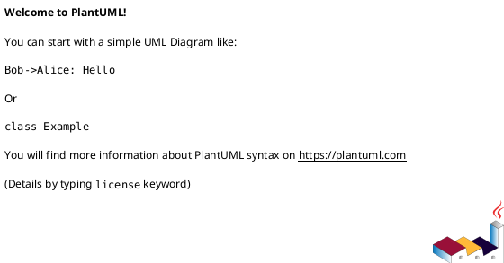
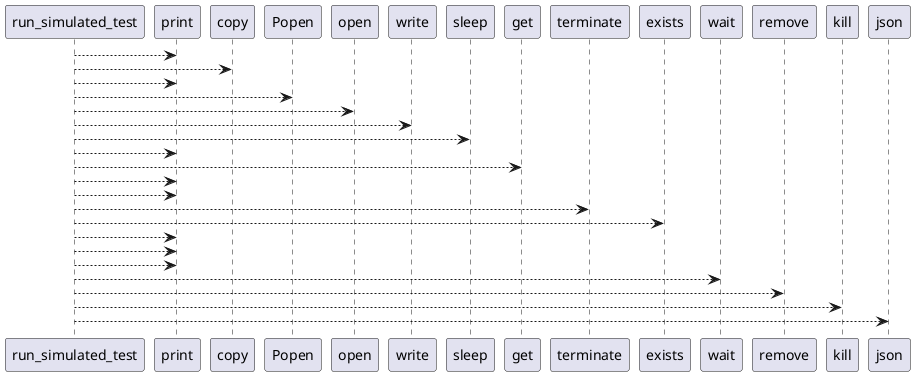

# Module: `tests/controller/simulated_integration_test.py`

## Overview
**Purpose**: Module providing various functionalities.

**Architecture Role**: Controllers

**Dependencies**:
- `sys`
- `requests`
- `subprocess`
- `os`
- `time`

**Exported Symbols**:
- `run_simulated_test`

## UML Class Diagram

## Call Graph

## Classes
## Functions
### Function `run_simulated_test`
- **Description**: No description available.
- **Inputs**:
- **Output**: `Any`
- **Side Effects**: Not documented
- **Complexity**: Not documented
