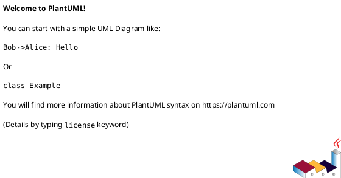

# Module: `tests/controller/test_kafka_app.py`

## Overview
**Purpose**: Module providing various functionalities.

**Architecture Role**: Controllers

**Dependencies**:
- `confluent_kafka`
- `fastapi`
- `regression_model_template.controller.kafka_app`
- `json`
- `pytest`
- `unittest.mock`

**Exported Symbols**:
- `mock_kafka_service`
- `test_initialization`
- `test_delivery_report`
- `test_start`
- `test_start_producer_failure`
- `test_start_consumer_failure`
- `test_run_server`
- `test_run_server_failure`
- `test_consume_messages`
- `test_consume_messages_with_error`
- `test_poll_message`
- `test_poll_message_no_consumer`
- `test_handle_message_error_partition_eof`
- `test_handle_message_error_other_error`
- `test_handle_message_error_unknown_topic`
- `test_process_message`
- `test_process_message_json_decode_error`
- `test_process_message_prediction_error`
- `test_close_consumer`
- `test_stop`
- `test_main_function`
- `test_middleware_configuration`

## UML Class Diagram

## Call Graph

```plantuml
@startuml
mock_kafka_service --> patch
mock_kafka_service --> patch
mock_kafka_service --> patch
mock_kafka_service --> patch
mock_kafka_service --> MagicMock
mock_kafka_service --> MagicMock
mock_kafka_service --> MagicMock
mock_kafka_service --> MagicMock
mock_kafka_service --> FastAPIKafkaService
mock_kafka_service --> PredictionResponse
test_delivery_report --> MagicMock
test_delivery_report --> patch
test_delivery_report --> delivery_report
test_delivery_report --> assert_called_once
test_delivery_report --> patch
test_delivery_report --> delivery_report
test_delivery_report --> assert_called_once
test_start --> start
test_start --> assert_called_once_with
test_start --> assert_called_once_with
test_start --> assert_called_once_with
test_start_producer_failure --> Exception
test_start_producer_failure --> raises
test_start_producer_failure --> start
test_start_consumer_failure --> Exception
test_start_consumer_failure --> raises
test_start_consumer_failure --> start
test_run_server --> patch
test_run_server --> _run_server
test_run_server --> assert_called_once_with
test_run_server_failure --> patch
test_run_server_failure --> Exception
test_run_server_failure --> _run_server
test_consume_messages --> MagicMock
test_consume_messages --> MagicMock
test_consume_messages --> MagicMock
test_consume_messages --> MagicMock
test_consume_messages --> MagicMock
test_consume_messages --> MagicMock
test_consume_messages --> MagicMock
test_consume_messages --> _consume_messages
test_consume_messages --> assert_called_once
test_consume_messages --> assert_called_once
test_consume_messages --> assert_called_once
test_consume_messages --> MagicMock
test_consume_messages --> MagicMock
test_consume_messages_with_error --> MagicMock
test_consume_messages_with_error --> MagicMock
test_consume_messages_with_error --> MagicMock
test_consume_messages_with_error --> MagicMock
test_consume_messages_with_error --> MagicMock
test_consume_messages_with_error --> MagicMock
test_consume_messages_with_error --> MagicMock
test_consume_messages_with_error --> MagicMock
test_consume_messages_with_error --> MagicMock
test_consume_messages_with_error --> _consume_messages
test_consume_messages_with_error --> assert_called_once
test_consume_messages_with_error --> assert_not_called
test_consume_messages_with_error --> assert_called_once
test_consume_messages_with_error --> MagicMock
test_consume_messages_with_error --> MagicMock
test_poll_message --> MagicMock
test_poll_message --> _poll_message
test_poll_message --> assert_called_once_with
test_poll_message_no_consumer --> patch
test_poll_message_no_consumer --> _poll_message
test_poll_message_no_consumer --> assert_called_once
test_handle_message_error_partition_eof --> MagicMock
test_handle_message_error_partition_eof --> MagicMock
test_handle_message_error_partition_eof --> patch
test_handle_message_error_partition_eof --> _handle_message_error
test_handle_message_error_partition_eof --> assert_called_once
test_handle_message_error_partition_eof --> MagicMock
test_handle_message_error_other_error --> MagicMock
test_handle_message_error_other_error --> MagicMock
test_handle_message_error_other_error --> patch
test_handle_message_error_other_error --> _handle_message_error
test_handle_message_error_other_error --> assert_called_once
test_handle_message_error_other_error --> MagicMock
test_handle_message_error_unknown_topic --> MagicMock
test_handle_message_error_unknown_topic --> MagicMock
test_handle_message_error_unknown_topic --> patch
test_handle_message_error_unknown_topic --> _handle_message_error
test_handle_message_error_unknown_topic --> assert_called_once
test_handle_message_error_unknown_topic --> MagicMock
test_process_message --> patch
test_process_message --> MagicMock
test_process_message --> encode
test_process_message --> dumps
test_process_message --> MagicMock
test_process_message --> MagicMock
test_process_message --> PredictionResponse
test_process_message --> _process_message
test_process_message --> assert_called_once
test_process_message --> assert_called_once
test_process_message --> assert_called_once_with
test_process_message --> assert_called_once_with
test_process_message --> PredictionRequest
test_process_message --> dumps
test_process_message_json_decode_error --> patch
test_process_message_json_decode_error --> JSONDecodeError
test_process_message_json_decode_error --> MagicMock
test_process_message_json_decode_error --> MagicMock
test_process_message_json_decode_error --> MagicMock
test_process_message_json_decode_error --> assert_not_called
test_process_message_json_decode_error --> assert_called_once
test_process_message_json_decode_error --> patch
test_process_message_json_decode_error --> _process_message
test_process_message_json_decode_error --> assert_called
test_process_message_prediction_error --> patch
test_process_message_prediction_error --> MagicMock
test_process_message_prediction_error --> encode
test_process_message_prediction_error --> dumps
test_process_message_prediction_error --> MagicMock
test_process_message_prediction_error --> MagicMock
test_process_message_prediction_error --> Exception
test_process_message_prediction_error --> assert_called_once
test_process_message_prediction_error --> assert_called_once
test_process_message_prediction_error --> PredictionRequest
test_process_message_prediction_error --> patch
test_process_message_prediction_error --> _process_message
test_process_message_prediction_error --> assert_called
test_process_message_prediction_error --> dumps
test_close_consumer --> MagicMock
test_close_consumer --> _close_consumer
test_close_consumer --> assert_called_once
test_close_consumer --> patch
test_close_consumer --> _close_consumer
test_close_consumer --> assert_called
test_stop --> MagicMock
test_stop --> stop
test_stop --> assert_called_once
test_stop --> is_set
test_stop --> patch
test_stop --> stop
test_stop --> is_set
test_main_function --> patch
test_main_function --> patch
test_main_function --> patch
test_main_function --> patch
test_main_function --> patch
test_main_function --> MagicMock
test_main_function --> MagicMock
test_main_function --> MagicMock
test_main_function --> MagicMock
test_main_function --> main
test_main_function --> assert_called_once
test_main_function --> assert_called_once
test_main_function --> assert_called_once
test_main_function --> assert_called_once
test_main_function --> assert_called_once_with
test_main_function --> assert_called_once
test_main_function --> assert_called_once
test_main_function --> assert_called
@enduml
```

## Classes
## Functions
### Function `mock_kafka_service`
- **Description**: Fixture to create a mocked FastAPIKafkaService.
- **Inputs**:
- **Output**: `Any`
- **Side Effects**: Not documented
- **Complexity**: Not documented

### Function `test_initialization`
- **Description**: Test FastAPIKafkaService initialization.
- **Inputs**:
  - `mock_kafka_service`: Any
- **Output**: `Any`
- **Side Effects**: Not documented
- **Complexity**: Not documented

### Function `test_delivery_report`
- **Description**: Test delivery report logging.
- **Inputs**:
  - `mock_kafka_service`: Any
- **Output**: `Any`
- **Side Effects**: Not documented
- **Complexity**: Not documented

### Function `test_start`
- **Description**: Test the start method.
- **Inputs**:
  - `mock_kafka_service`: Any
- **Output**: `Any`
- **Side Effects**: Not documented
- **Complexity**: Not documented

### Function `test_start_producer_failure`
- **Description**: Test start method when producer initialization fails.
- **Inputs**:
  - `mock_kafka_service`: Any
- **Output**: `Any`
- **Side Effects**: Not documented
- **Complexity**: Not documented

### Function `test_start_consumer_failure`
- **Description**: Test start method when consumer initialization fails.
- **Inputs**:
  - `mock_kafka_service`: Any
- **Output**: `Any`
- **Side Effects**: Not documented
- **Complexity**: Not documented

### Function `test_run_server`
- **Description**: Test the _run_server method.
- **Inputs**:
  - `mock_kafka_service`: Any
- **Output**: `Any`
- **Side Effects**: Not documented
- **Complexity**: Not documented

### Function `test_run_server_failure`
- **Description**: Test the _run_server method when uvicorn fails.
- **Inputs**:
  - `mock_kafka_service`: Any
- **Output**: `Any`
- **Side Effects**: Not documented
- **Complexity**: Not documented

### Function `test_consume_messages`
- **Description**: Test the _consume_messages method.
- **Inputs**:
  - `mock_kafka_service`: Any
- **Output**: `Any`
- **Side Effects**: Not documented
- **Complexity**: Not documented

### Function `test_consume_messages_with_error`
- **Description**: Test _consume_messages handles message errors.
- **Inputs**:
  - `mock_kafka_service`: Any
- **Output**: `Any`
- **Side Effects**: Not documented
- **Complexity**: Not documented

### Function `test_poll_message`
- **Description**: Test the _poll_message method.
- **Inputs**:
  - `mock_kafka_service`: Any
- **Output**: `Any`
- **Side Effects**: Not documented
- **Complexity**: Not documented

### Function `test_poll_message_no_consumer`
- **Description**: Test _poll_message handles missing consumer.
- **Inputs**:
  - `mock_kafka_service`: Any
- **Output**: `Any`
- **Side Effects**: Not documented
- **Complexity**: Not documented

### Function `test_handle_message_error_partition_eof`
- **Description**: Test _handle_message_error handles partition EOF.
- **Inputs**:
  - `mock_kafka_service`: Any
- **Output**: `Any`
- **Side Effects**: Not documented
- **Complexity**: Not documented

### Function `test_handle_message_error_other_error`
- **Description**: Test _handle_message_error handles other Kafka errors.
- **Inputs**:
  - `mock_kafka_service`: Any
- **Output**: `Any`
- **Side Effects**: Not documented
- **Complexity**: Not documented

### Function `test_handle_message_error_unknown_topic`
- **Description**: Test _handle_message_error handles transient UNKNOWN_TOPIC_OR_PART errors without breaking loop.
- **Inputs**:
  - `mock_kafka_service`: Any
- **Output**: `Any`
- **Side Effects**: Not documented
- **Complexity**: Not documented

### Function `test_process_message`
- **Description**: Test the _process_message method.
- **Inputs**:
  - `mock_json_loads`: Any
  - `mock_kafka_service`: Any
- **Output**: `Any`
- **Side Effects**: Not documented
- **Complexity**: Not documented

### Function `test_process_message_json_decode_error`
- **Description**: Test _process_message handles JSON decoding errors.
- **Inputs**:
  - `mock_json_loads`: Any
  - `mock_kafka_service`: Any
- **Output**: `Any`
- **Side Effects**: Not documented
- **Complexity**: Not documented

### Function `test_process_message_prediction_error`
- **Description**: Test _process_message handles prediction callback errors.
- **Inputs**:
  - `mock_json_loads`: Any
  - `mock_kafka_service`: Any
- **Output**: `Any`
- **Side Effects**: Not documented
- **Complexity**: Not documented

### Function `test_close_consumer`
- **Description**: Test the _close_consumer method.
- **Inputs**:
  - `mock_kafka_service`: Any
- **Output**: `Any`
- **Side Effects**: Not documented
- **Complexity**: Not documented

### Function `test_stop`
- **Description**: Test the stop method.
- **Inputs**:
  - `mock_kafka_service`: Any
- **Output**: `Any`
- **Side Effects**: Not documented
- **Complexity**: Not documented

### Function `test_main_function`
- **Description**: Test the main function.
- **Inputs**:
- **Output**: `Any`
- **Side Effects**: Not documented
- **Complexity**: Not documented

### Function `test_middleware_configuration`
- **Description**: Test that security middlewares are configured.
- **Inputs**:
- **Output**: `Any`
- **Side Effects**: Not documented
- **Complexity**: Not documented
