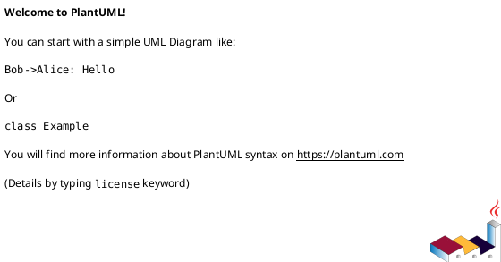
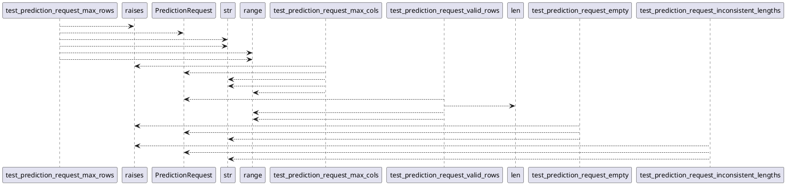

# Module: `tests/controller/test_kafka_app_dos.py`

## Overview
**Purpose**: Module providing various functionalities.

**Architecture Role**: Controllers

**Dependencies**:
- `pytest`
- `regression_model_template.controller.kafka_app`
- `pydantic`

**Exported Symbols**:
- `test_prediction_request_max_rows`
- `test_prediction_request_max_cols`
- `test_prediction_request_valid_rows`
- `test_prediction_request_empty`
- `test_prediction_request_inconsistent_lengths`

## UML Class Diagram

## Call Graph

## Classes
## Functions
### Function `test_prediction_request_max_rows`
- **Description**: Test that PredictionRequest enforces max rows limit.
- **Inputs**:
- **Output**: `Any`
- **Side Effects**: Not documented
- **Complexity**: Not documented

### Function `test_prediction_request_max_cols`
- **Description**: Test that PredictionRequest enforces max cols limit.
- **Inputs**:
- **Output**: `Any`
- **Side Effects**: Not documented
- **Complexity**: Not documented

### Function `test_prediction_request_valid_rows`
- **Description**: Test that PredictionRequest accepts valid rows.
- **Inputs**:
- **Output**: `Any`
- **Side Effects**: Not documented
- **Complexity**: Not documented

### Function `test_prediction_request_empty`
- **Description**: Test that PredictionRequest rejects empty input.
- **Inputs**:
- **Output**: `Any`
- **Side Effects**: Not documented
- **Complexity**: Not documented

### Function `test_prediction_request_inconsistent_lengths`
- **Description**: Test that PredictionRequest rejects inconsistent column lengths.
- **Inputs**:
- **Output**: `Any`
- **Side Effects**: Not documented
- **Complexity**: Not documented
