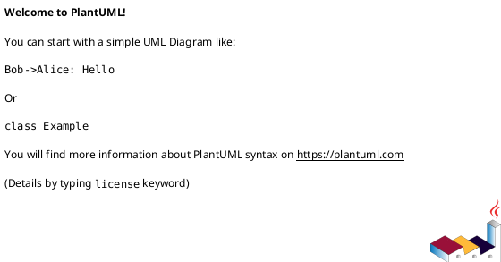
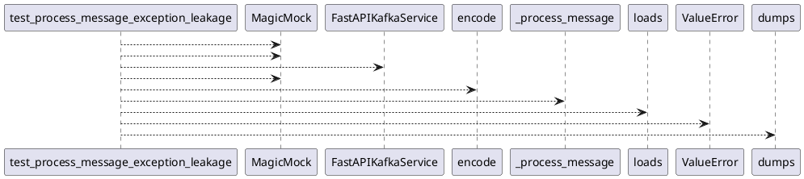

# Module: `tests/controller/test_kafka_app_leakage.py`

## Overview
**Purpose**: Module providing various functionalities.

**Architecture Role**: Controllers

**Dependencies**:
- `regression_model_template.controller.kafka_app`
- `json`
- `unittest.mock`

**Exported Symbols**:
- `test_process_message_exception_leakage`

## UML Class Diagram

## Call Graph

## Classes
## Functions
### Function `test_process_message_exception_leakage`
- **Description**: No description available.
- **Inputs**:
- **Output**: `Any`
- **Side Effects**: Not documented
- **Complexity**: Not documented
