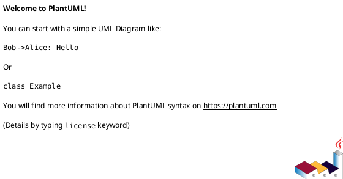
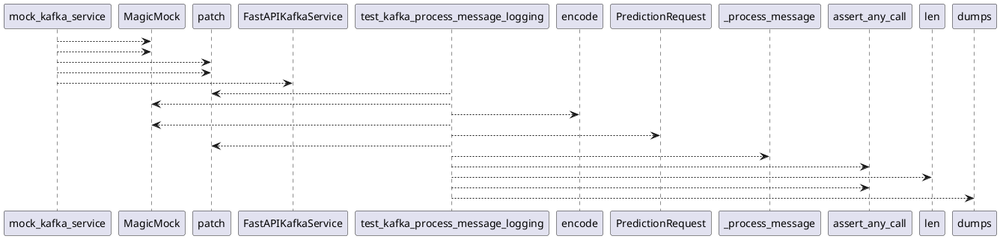

# Module: `tests/controller/test_kafka_app_logging.py`

## Overview
**Purpose**: Module providing various functionalities.

**Architecture Role**: Controllers

**Dependencies**:
- `pytest`
- `regression_model_template.controller.kafka_app`
- `json`
- `unittest.mock`

**Exported Symbols**:
- `mock_kafka_service`
- `test_kafka_process_message_logging`

## UML Class Diagram

## Call Graph

## Classes
## Functions
### Function `mock_kafka_service`
- **Description**: Mock the FastAPIKafkaService and its dependencies.
- **Inputs**:
- **Output**: `Any`
- **Side Effects**: Not documented
- **Complexity**: Not documented

### Function `test_kafka_process_message_logging`
- **Description**: Test that Kafka consumer logs correctly using debug and safe info logs.
- **Inputs**:
  - `mock_logger`: Any
  - `mock_kafka_service`: Any
- **Output**: `Any`
- **Side Effects**: Not documented
- **Complexity**: Not documented
