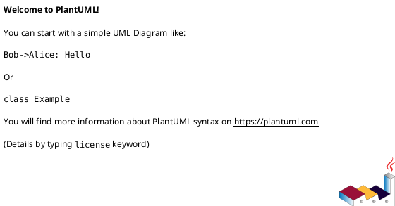
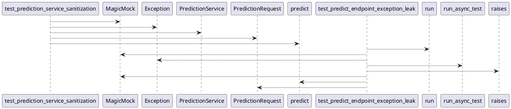

# Module: `tests/controller/test_kafka_app_security.py`

## Overview
**Purpose**: Module providing various functionalities.

**Architecture Role**: Controllers

**Dependencies**:
- `fastapi`
- `regression_model_template.controller.kafka_app`
- `asyncio`
- `pytest`
- `unittest.mock`

**Exported Symbols**:
- `test_prediction_service_sanitization`
- `test_predict_endpoint_exception_leak`

## UML Class Diagram

## Call Graph

## Classes
## Functions
### Function `test_prediction_service_sanitization`
- **Description**: Test that PredictionService sanitizes exceptions.
- **Inputs**:
- **Output**: `Any`
- **Side Effects**: Not documented
- **Complexity**: Not documented

### Function `test_predict_endpoint_exception_leak`
- **Description**: Test that the predict endpoint does NOT leak exception details.
- **Inputs**:
- **Output**: `Any`
- **Side Effects**: Not documented
- **Complexity**: Not documented
