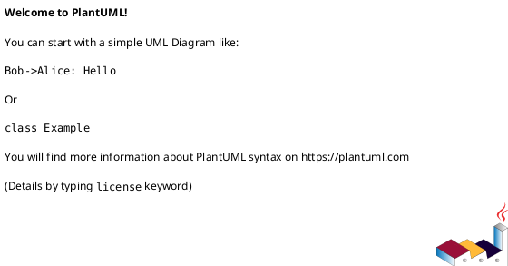
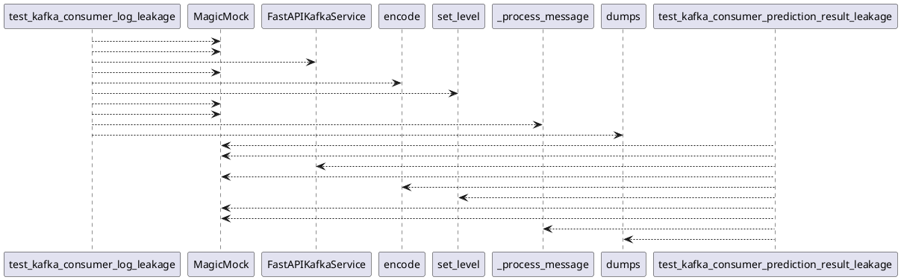

# Module: `tests/controller/test_log_leakage.py`

## Overview
**Purpose**: Module providing various functionalities.

**Architecture Role**: Controllers

**Dependencies**:
- `regression_model_template.controller.kafka_app`
- `logging`
- `pytest`
- `pandas`
- `unittest.mock`

**Exported Symbols**:
- `test_kafka_consumer_log_leakage`
- `test_kafka_consumer_prediction_result_leakage`

## UML Class Diagram

## Call Graph

## Classes
## Functions
### Function `test_kafka_consumer_log_leakage`
- **Description**: Test that the Kafka consumer processing does not log sensitive information at INFO level.
- **Inputs**:
  - `caplog`: Any
- **Output**: `Any`
- **Side Effects**: Not documented
- **Complexity**: Not documented

### Function `test_kafka_consumer_prediction_result_leakage`
- **Description**: Test that the Kafka consumer processing does not log raw prediction result values (inference)
at any log level, and instead uses a masked/summarized format.
- **Inputs**:
  - `caplog`: Any
- **Output**: `Any`
- **Side Effects**: Not documented
- **Complexity**: Not documented
