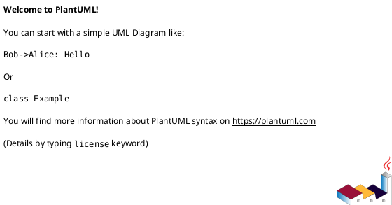
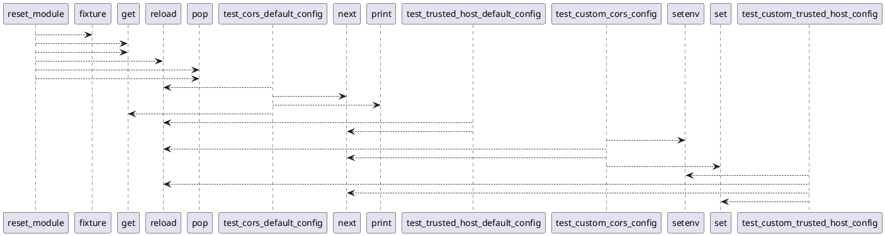

# Module: `tests/controller/test_middleware_config.py`

## Overview
**Purpose**: Module providing various functionalities.

**Architecture Role**: Controllers

**Dependencies**:
- `fastapi.middleware.cors`
- `importlib`
- `regression_model_template.controller`
- `pytest`
- `fastapi.middleware.trustedhost`
- `os`

**Exported Symbols**:
- `reset_module`
- `test_middleware_presence`
- `test_cors_default_config`
- `test_trusted_host_default_config`
- `test_custom_cors_config`
- `test_custom_trusted_host_config`

## UML Class Diagram

## Call Graph

## Classes
## Functions
### Function `reset_module`
- **Description**: Reset module and env vars after each test to prevent state leakage.
- **Inputs**:
- **Output**: `Any`
- **Side Effects**: Not documented
- **Complexity**: Not documented

### Function `test_middleware_presence`
- **Description**: Verify that CORSMiddleware and TrustedHostMiddleware are present.
- **Inputs**:
- **Output**: `Any`
- **Side Effects**: Not documented
- **Complexity**: Not documented

### Function `test_cors_default_config`
- **Description**: Verify default CORS configuration.
- **Inputs**:
- **Output**: `Any`
- **Side Effects**: Not documented
- **Complexity**: Not documented

### Function `test_trusted_host_default_config`
- **Description**: Verify default TrustedHost configuration.
- **Inputs**:
- **Output**: `Any`
- **Side Effects**: Not documented
- **Complexity**: Not documented

### Function `test_custom_cors_config`
- **Description**: Verify custom CORS configuration via environment variables.
- **Inputs**:
  - `monkeypatch`: Any
- **Output**: `Any`
- **Side Effects**: Not documented
- **Complexity**: Not documented

### Function `test_custom_trusted_host_config`
- **Description**: Verify custom TrustedHost configuration via environment variables.
- **Inputs**:
  - `monkeypatch`: Any
- **Output**: `Any`
- **Side Effects**: Not documented
- **Complexity**: Not documented
