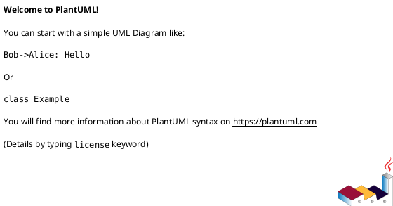
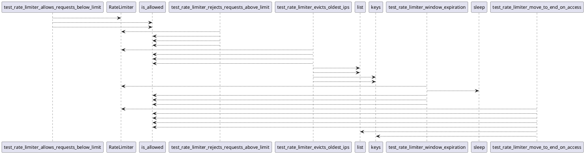

# Module: `tests/controller/test_rate_limiter.py`

## Overview
**Purpose**: Module providing various functionalities.

**Architecture Role**: Controllers

**Dependencies**:
- `regression_model_template.controller.kafka_app`
- `time`

**Exported Symbols**:
- `test_rate_limiter_allows_requests_below_limit`
- `test_rate_limiter_rejects_requests_above_limit`
- `test_rate_limiter_evicts_oldest_ips`
- `test_rate_limiter_window_expiration`
- `test_rate_limiter_move_to_end_on_access`

## UML Class Diagram

## Call Graph

## Classes
## Functions
### Function `test_rate_limiter_allows_requests_below_limit`
- **Description**: No description available.
- **Inputs**:
- **Output**: `Any`
- **Side Effects**: Not documented
- **Complexity**: Not documented

### Function `test_rate_limiter_rejects_requests_above_limit`
- **Description**: No description available.
- **Inputs**:
- **Output**: `Any`
- **Side Effects**: Not documented
- **Complexity**: Not documented

### Function `test_rate_limiter_evicts_oldest_ips`
- **Description**: No description available.
- **Inputs**:
- **Output**: `Any`
- **Side Effects**: Not documented
- **Complexity**: Not documented

### Function `test_rate_limiter_window_expiration`
- **Description**: No description available.
- **Inputs**:
- **Output**: `Any`
- **Side Effects**: Not documented
- **Complexity**: Not documented

### Function `test_rate_limiter_move_to_end_on_access`
- **Description**: No description available.
- **Inputs**:
- **Output**: `Any`
- **Side Effects**: Not documented
- **Complexity**: Not documented
