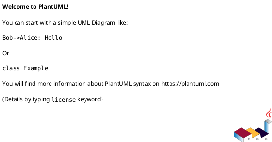
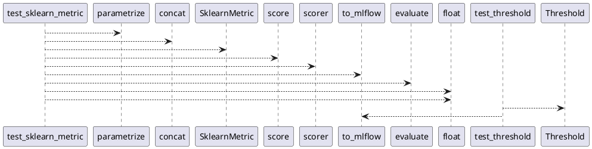

# Module: `tests/core/test_metrics.py`

## Overview
**Purpose**: Module providing various functionalities.

**Architecture Role**: Infrastructure

**Dependencies**:
- `pandas`
- `pytest`
- `mlflow`
- `regression_model_template.core`

**Exported Symbols**:
- `test_sklearn_metric`
- `test_threshold`

## UML Class Diagram

## Call Graph

## Classes
## Functions
### Function `test_sklearn_metric`
- **Description**: No description available.
- **Inputs**:
  - `name`: str
  - `interval`: tuple[int, int]
  - `greater_is_better`: bool
  - `model`: models.Model
  - `inputs`: schemas.Inputs
  - `targets`: schemas.Targets
  - `outputs`: schemas.Outputs
- **Output**: `None`
- **Side Effects**: Not documented
- **Complexity**: Not documented

### Function `test_threshold`
- **Description**: No description available.
- **Inputs**:
- **Output**: `None`
- **Side Effects**: Not documented
- **Complexity**: Not documented
