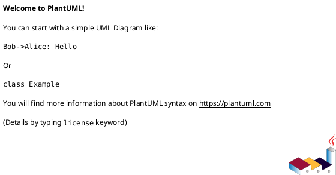
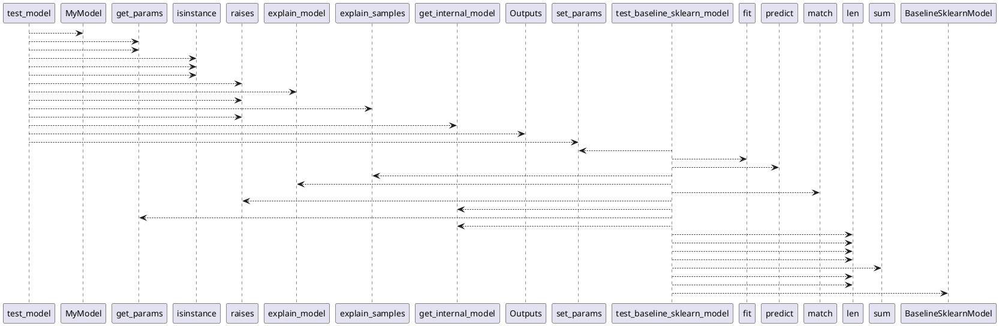

# Module: `tests/core/test_models.py`

## Overview
**Purpose**: Module providing various functionalities.

**Architecture Role**: Domain Models

**Dependencies**:
- `typing`
- `pytest`
- `regression_model_template.core`

**Exported Symbols**:
- `test_model`
- `test_baseline_sklearn_model`

## UML Class Diagram

## Call Graph

## Classes
## Functions
### Function `test_model`
- **Description**: No description available.
- **Inputs**:
  - `inputs_samples`: schemas.Inputs
- **Output**: `None`
- **Side Effects**: Not documented
- **Complexity**: Not documented

### Function `test_baseline_sklearn_model`
- **Description**: No description available.
- **Inputs**:
  - `train_test_sets`: tuple[schemas.Inputs, schemas.Targets, schemas.Inputs, schemas.Targets]
- **Output**: `None`
- **Side Effects**: Not documented
- **Complexity**: Not documented
