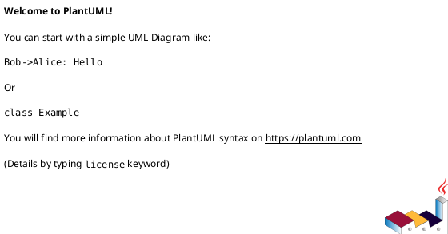
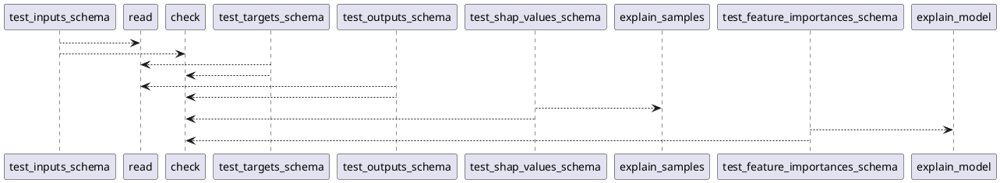

# Module: `tests/core/test_schemas.py`

## Overview
**Purpose**: Module providing various functionalities.

**Architecture Role**: DTOs

**Dependencies**:
- `regression_model_template.core`
- `regression_model_template.io`

**Exported Symbols**:
- `test_inputs_schema`
- `test_targets_schema`
- `test_outputs_schema`
- `test_shap_values_schema`
- `test_feature_importances_schema`

## UML Class Diagram

## Call Graph

## Classes
## Functions
### Function `test_inputs_schema`
- **Description**: No description available.
- **Inputs**:
  - `inputs_reader`: datasets.Reader
- **Output**: `None`
- **Side Effects**: Not documented
- **Complexity**: Not documented

### Function `test_targets_schema`
- **Description**: No description available.
- **Inputs**:
  - `targets_reader`: datasets.Reader
- **Output**: `None`
- **Side Effects**: Not documented
- **Complexity**: Not documented

### Function `test_outputs_schema`
- **Description**: No description available.
- **Inputs**:
  - `outputs_reader`: datasets.Reader
- **Output**: `None`
- **Side Effects**: Not documented
- **Complexity**: Not documented

### Function `test_shap_values_schema`
- **Description**: No description available.
- **Inputs**:
  - `model`: models.Model
  - `train_test_sets`: tuple[schemas.Inputs, schemas.Targets, schemas.Inputs, schemas.Targets]
- **Output**: `None`
- **Side Effects**: Not documented
- **Complexity**: Not documented

### Function `test_feature_importances_schema`
- **Description**: No description available.
- **Inputs**:
  - `model`: models.Model
- **Output**: `None`
- **Side Effects**: Not documented
- **Complexity**: Not documented
