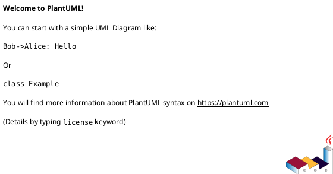
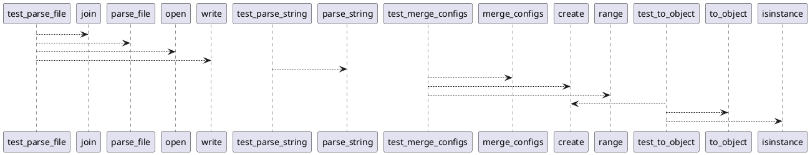

# Module: `tests/io/test_configs.py`

## Overview
**Purpose**: Module providing various functionalities.

**Architecture Role**: Infrastructure

**Dependencies**:
- `omegaconf`
- `regression_model_template.io`
- `os`

**Exported Symbols**:
- `test_parse_file`
- `test_parse_string`
- `test_merge_configs`
- `test_to_object`

## UML Class Diagram

## Call Graph

## Classes
## Functions
### Function `test_parse_file`
- **Description**: No description available.
- **Inputs**:
  - `tmp_path`: str
- **Output**: `None`
- **Side Effects**: Not documented
- **Complexity**: Not documented

### Function `test_parse_string`
- **Description**: No description available.
- **Inputs**:
- **Output**: `None`
- **Side Effects**: Not documented
- **Complexity**: Not documented

### Function `test_merge_configs`
- **Description**: No description available.
- **Inputs**:
- **Output**: `None`
- **Side Effects**: Not documented
- **Complexity**: Not documented

### Function `test_to_object`
- **Description**: No description available.
- **Inputs**:
- **Output**: `None`
- **Side Effects**: Not documented
- **Complexity**: Not documented
