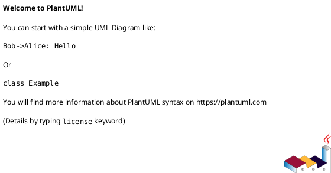
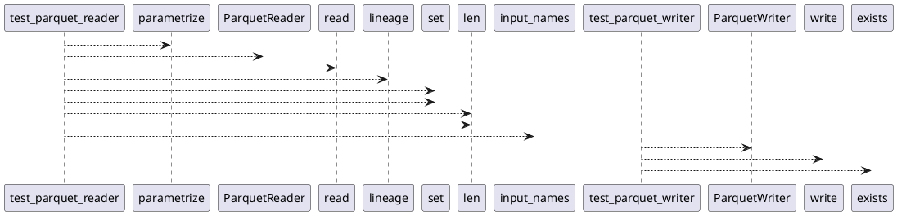

# Module: `tests/io/test_datasets.py`

## Overview
**Purpose**: Module providing various functionalities.

**Architecture Role**: Infrastructure

**Dependencies**:
- `pytest`
- `regression_model_template.io`
- `regression_model_template.core`
- `os`

**Exported Symbols**:
- `test_parquet_reader`
- `test_parquet_writer`

## UML Class Diagram

## Call Graph

## Classes
## Functions
### Function `test_parquet_reader`
- **Description**: No description available.
- **Inputs**:
  - `limit`: int | None
  - `inputs_path`: str
- **Output**: `None`
- **Side Effects**: Not documented
- **Complexity**: Not documented

### Function `test_parquet_writer`
- **Description**: No description available.
- **Inputs**:
  - `targets`: schemas.Targets
  - `tmp_outputs_path`: str
- **Output**: `None`
- **Side Effects**: Not documented
- **Complexity**: Not documented
