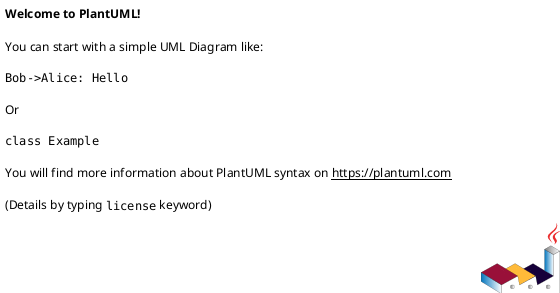
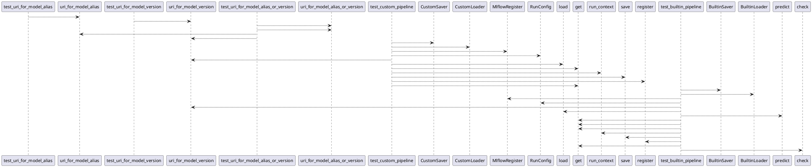

# Module: `tests/io/test_registries.py`

## Overview
**Purpose**: Module providing various functionalities.

**Architecture Role**: Infrastructure

**Dependencies**:
- `regression_model_template.core`
- `regression_model_template.io`
- `regression_model_template.utils`

**Exported Symbols**:
- `test_uri_for_model_alias`
- `test_uri_for_model_version`
- `test_uri_for_model_alias_or_version`
- `test_custom_pipeline`
- `test_builtin_pipeline`

## UML Class Diagram

## Call Graph

## Classes
## Functions
### Function `test_uri_for_model_alias`
- **Description**: No description available.
- **Inputs**:
- **Output**: `None`
- **Side Effects**: Not documented
- **Complexity**: Not documented

### Function `test_uri_for_model_version`
- **Description**: No description available.
- **Inputs**:
- **Output**: `None`
- **Side Effects**: Not documented
- **Complexity**: Not documented

### Function `test_uri_for_model_alias_or_version`
- **Description**: No description available.
- **Inputs**:
- **Output**: `None`
- **Side Effects**: Not documented
- **Complexity**: Not documented

### Function `test_custom_pipeline`
- **Description**: No description available.
- **Inputs**:
  - `model`: models.Model
  - `inputs`: schemas.Inputs
  - `signature`: signers.Signature
  - `mlflow_service`: services.MlflowService
- **Output**: `None`
- **Side Effects**: Not documented
- **Complexity**: Not documented

### Function `test_builtin_pipeline`
- **Description**: No description available.
- **Inputs**:
  - `model`: models.Model
  - `inputs`: schemas.Inputs
  - `signature`: signers.Signature
  - `mlflow_service`: services.MlflowService
- **Output**: `None`
- **Side Effects**: Not documented
- **Complexity**: Not documented
