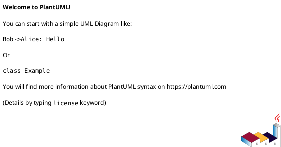
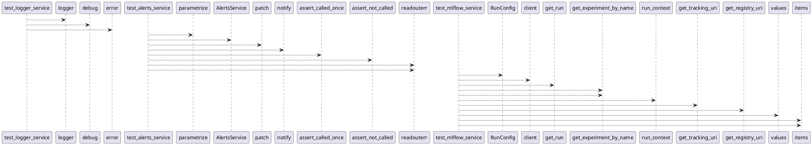

# Module: `tests/io/test_services.py`

## Overview
**Purpose**: Module providing various functionalities.

**Architecture Role**: Services

**Dependencies**:
- `_pytest.capture`
- `plyer`
- `_pytest.logging`
- `pytest_mock`
- `mlflow`
- `pytest`
- `regression_model_template.io`

**Exported Symbols**:
- `test_logger_service`
- `test_alerts_service`
- `test_mlflow_service`

## UML Class Diagram

## Call Graph

## Classes
## Functions
### Function `test_logger_service`
- **Description**: No description available.
- **Inputs**:
  - `logger_service`: services.LoggerService
  - `logger_caplog`: pl.LogCaptureFixture
- **Output**: `None`
- **Side Effects**: Not documented
- **Complexity**: Not documented

### Function `test_alerts_service`
- **Description**: No description available.
- **Inputs**:
  - `enable`: bool
  - `mocker`: pm.MockerFixture
  - `capsys`: pc.CaptureFixture[str]
- **Output**: `None`
- **Side Effects**: Not documented
- **Complexity**: Not documented

### Function `test_mlflow_service`
- **Description**: No description available.
- **Inputs**:
  - `mlflow_service`: services.MlflowService
- **Output**: `None`
- **Side Effects**: Not documented
- **Complexity**: Not documented
