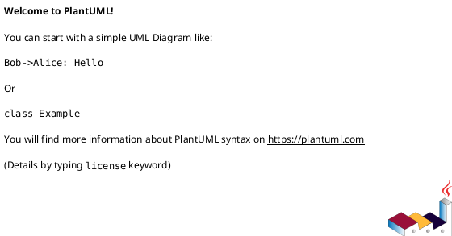
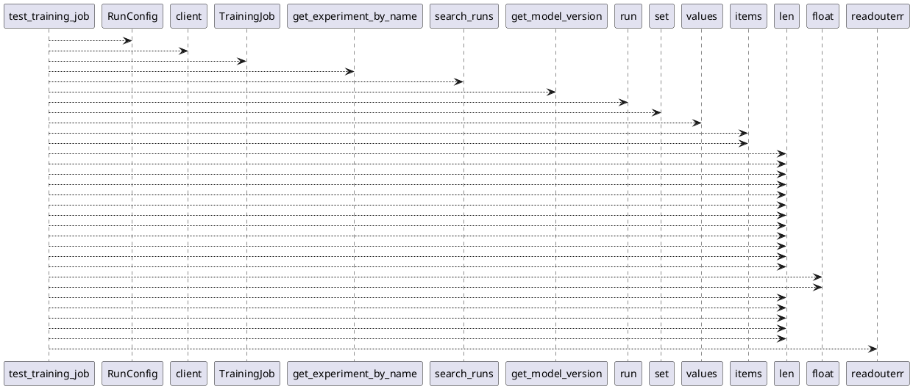

# Module: `tests/jobs/test_training.py`

## Overview
**Purpose**: Module providing various functionalities.

**Architecture Role**: Infrastructure

**Dependencies**:
- `_pytest.capture`
- `regression_model_template`
- `regression_model_template.core`
- `regression_model_template.io`
- `regression_model_template.utils`

**Exported Symbols**:
- `test_training_job`

## UML Class Diagram

## Call Graph

## Classes
## Functions
### Function `test_training_job`
- **Description**: No description available.
- **Inputs**:
  - `mlflow_service`: services.MlflowService
  - `alerts_service`: services.AlertsService
  - `logger_service`: services.LoggerService
  - `inputs_reader`: datasets.ParquetReader
  - `targets_reader`: datasets.ParquetReader
  - `model`: models.Model
  - `metric`: metrics.Metric
  - `train_test_splitter`: splitters.Splitter
  - `saver`: registries.Saver
  - `signer`: signers.Signer
  - `register`: registries.Register
  - `capsys`: pc.CaptureFixture[str]
- **Output**: `None`
- **Side Effects**: Not documented
- **Complexity**: Not documented
