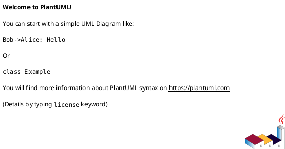
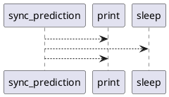

# Module: `tests/performance/benchmark_blocking.py`

## Overview
**Purpose**: Module providing various functionalities.

**Architecture Role**: Infrastructure

**Dependencies**:
- `time`
- `asyncio`

**Exported Symbols**:
- `sync_prediction`

## UML Class Diagram

## Call Graph

## Classes
## Functions
### Function `sync_prediction`
- **Description**: Simulates a CPU-bound synchronous prediction call.
- **Inputs**:
- **Output**: `Any`
- **Side Effects**: Not documented
- **Complexity**: Not documented
