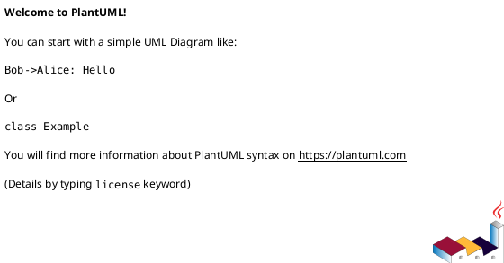
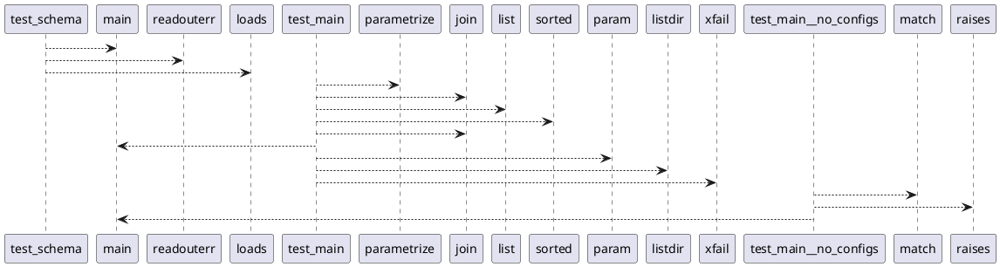

# Module: `tests/test_scripts.py`

## Overview
**Purpose**: Module providing various functionalities.

**Architecture Role**: Infrastructure

**Dependencies**:
- `pydantic`
- `json`
- `regression_model_template`
- `pytest`
- `_pytest`
- `os`

**Exported Symbols**:
- `test_schema`
- `test_main`
- `test_main__no_configs`

## UML Class Diagram

## Call Graph

## Classes
## Functions
### Function `test_schema`
- **Description**: No description available.
- **Inputs**:
  - `capsys`: pc.CaptureFixture[str]
- **Output**: `None`
- **Side Effects**: Not documented
- **Complexity**: Not documented

### Function `test_main`
- **Description**: No description available.
- **Inputs**:
  - `scenario`: str
  - `confs_path`: str
  - `extra_config`: str
- **Output**: `None`
- **Side Effects**: Not documented
- **Complexity**: Not documented

### Function `test_main__no_configs`
- **Description**: No description available.
- **Inputs**:
- **Output**: `None`
- **Side Effects**: Not documented
- **Complexity**: Not documented
