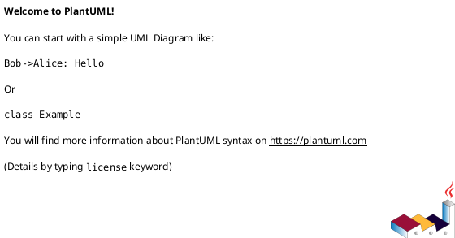
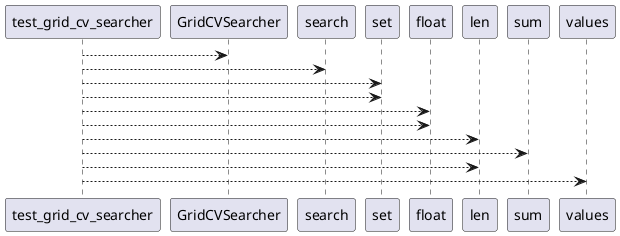

# Module: `tests/utils/test_searchers.py`

## Overview
**Purpose**: Module providing various functionalities.

**Architecture Role**: Infrastructure

**Dependencies**:
- `regression_model_template.core`
- `regression_model_template.utils`

**Exported Symbols**:
- `test_grid_cv_searcher`

## UML Class Diagram

## Call Graph

## Classes
## Functions
### Function `test_grid_cv_searcher`
- **Description**: No description available.
- **Inputs**:
  - `model`: models.Model
  - `metric`: metrics.Metric
  - `inputs`: schemas.Inputs
  - `targets`: schemas.Targets
  - `train_test_splitter`: splitters.Splitter
- **Output**: `None`
- **Side Effects**: Not documented
- **Complexity**: Not documented
