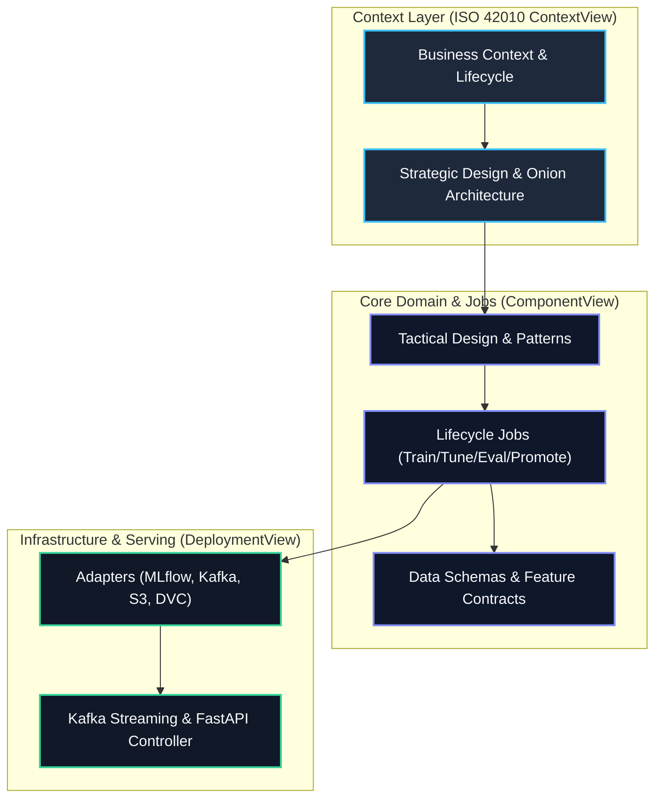

# MLOps Python Package — Enterprise Regression Lifecycle

> **Standards Compliance**: [ISO/IEC/IEEE 42010:2022](https://www.iso.org/standard/74428.html) (Architecture Descriptions) & [ISO/IEC/IEEE 15289:2019](https://www.iso.org/standard/72242.html) (Life Cycle Information Items).  
> **Repository**: `mlops-python-package`  
> **Core Domain**: Production-grade Machine Learning Operations (MLOps) architecture implementing an end-to-end regression model lifecycle from ingestion to streaming serving.

---

## 📌 Master Navigation & Entry Points

- [Master Viewpoint Index](index.md) · [Glossary & Ubiquitous Language](GLOSSARY.md) · [Repository Guide](README.md)

---

## 🏛️ Architecture Viewpoints (ISO 42010)

| Section | Focus Area | Key Architectural Deliverables |
| :--- | :--- | :--- |
| [**Business Context**](architecture/business_context.md) | Problem & Value | Business justification, ROI model, KPIs, and MLOps lifecycle stages. |
| [**Strategic Design**](architecture/strategic_design.md) | Macro Architecture | C4 Level 1 & 2 diagrams, Onion Architecture layers, Bounded Contexts. |
| [**Tactical Design**](architecture/tactical_design.md) | Micro Architecture | C4 Level 3 Component diagram, Strategy / Factory / Context Manager patterns. |
| [**Lifecycle Jobs**](architecture/agent_specifications.md) | Autonomous Workflows | Detailed behavioral contracts for Training, Tuning, Evaluations, Explanations, Inference, and Promotion. |
| [**Runtime Sequences**](architecture/runtime_sequences.md) | Execution Traces | End-to-end Mermaid sequence diagrams for batch lifecycle and Kafka streaming. |
| [**Data Model & Contracts**](architecture/mission_data_model.md) | Data Contracts | Pandera DataFrameModels (`Inputs`, `Targets`, `Outputs`, `SHAPValues`), Parquet schema contracts. |
| [**Infrastructure Adapters**](architecture/infrastructure_adapters.md) | External Integrations | MLflow Tracking Server, MinIO/S3, Confluent Kafka, DVC data versioning, Loguru/Alerts. |

---

## 🔒 Security & Governance

| Policy / Report | Description | Key Controls |
| :--- | :--- | :--- |
| [**Security Architecture**](security/security_architecture.md) | Threat Model & Defense | STRIDE analysis, cryptographic model signing (`InferSigner`), rate limiting, DoS defense. |
| [**HITL Governance**](security/hitl_governance.md) | Human-in-the-Loop Gates | Model registry promotion gates, champion-challenger threshold verification, manual sign-off. |
| [**Verification Triad**](security/verification_triad.md) | Quality Gates | 3-Vertex verification: Logical (Pytest), Architectural (Ruff/Mypy), Security (Sanitization). |
| [**Compliance & Audit**](security/compliance_audit.md) | Regulatory Alignment | EU AI Act conformity assessment, reproducibility standards, experiment tracking auditability. |

---

## ⚙️ Operations, Quality & Source Modules

- **Operations**: [User Manual](operations/user_manual.md) · [Production Operations & Deployment](operations/production_operations.md) · [Experiment Tracking Logs](operations/experiment_logs.md)
- **Quality**: [ISO 25010 Test Plan & Quality Report](quality/test_plan_report.md)
- **Codebase Mirror (1:1)**: Inspect all 29 underlying Python modules via the [Master Index Module Catalog](index.md#5-11-structural-codebase-mirror-modules).
