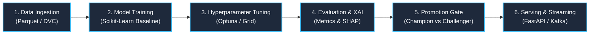

# Business Context & Machine Learning Lifecycle

> **Purpose**: Define the business rationale, return on investment (ROI), operational key performance indicators (KPIs), and lifecycle stages for the MLOps regression template.

---

## 1. Problem Statement & Value Proposition

Machine learning models deployed in production environments often suffer from **silent degradation**, **unreproducible experiments**, **schema mismatch vulnerabilities**, and **uncontrolled deployment drift**.

The `mlops-python-package` delivers an enterprise architecture that addresses these operational risks through:

1. **Deterministic Data Contracts**: Compile-time and runtime validation of all input features and target labels via Pandera and Pydantic v2.
2. **Auditable Experiment Lifecycle**: Comprehensive tracking of code versions, hyperparameter configurations, metrics, and model artifacts via MLflow.
3. **Decoupled Architecture**: Strict separation of core mathematical concepts (`core/`) from input/output mechanics (`io/`), operational jobs (`jobs/`), and streaming controllers (`controller/`).
4. **Governed Model Promotion**: Automated champion-challenger threshold evaluation before model artifact promotion to production aliases.
5. **Secure Serving**: High-throughput FastAPI endpoints with Kafka streaming integration, sliding-window rate limiting, and cryptographic payload signing.

---

## 2. ROI & Operational KPIs

| Metric | Target | Measurement Mechanism |
|:---|:---|:---|
| **Pipeline Reproducibility** | 100% | DVC pipeline execution & MLflow parameter tracking |
| **Schema Validation Coverage** | 100% | Pandera DataFrameModel validation at service boundaries |
| **Inference Latency** | < 15ms p99 | FastAPI async endpoint & Kafka batch streaming |
| **Test Suite Coverage** | ≥ 95% | 29 Pytest suites executed via CI/CD |
| **Audit Provenance** | 100% | Cryptographic SHA-256 signature via `InferSigner` |

---

## 3. The 6-Stage MLOps Lifecycle

1. **Data Ingestion**: Standardized reading of Parquet files via `ParquetReader` with lineage metadata.
2. **Model Training**: Executed by `TrainingJob`, fitting an extensible `Model` implementation.
3. **Hyperparameter Tuning**: Executed by `TuningJob`, optimizing hyperparameters over defined search spaces via Optuna.
4. **Evaluation & Explainability**: Executed by `EvaluationsJob` (evaluating against baseline thresholds) and `ExplanationsJob` (generating global and local SHAP feature attributions).
5. **Promotion Gate**: Executed by `PromotionJob`, validating challenger metrics against active production champion aliases.
6. **Production Serving**: Real-time batch and event-driven prediction serving via `FastAPIKafkaService`.

---

> *Related: [Strategic Design](strategic_design.md) · [Tactical Design](tactical_design.md) · [Master Index](../index.md)*
