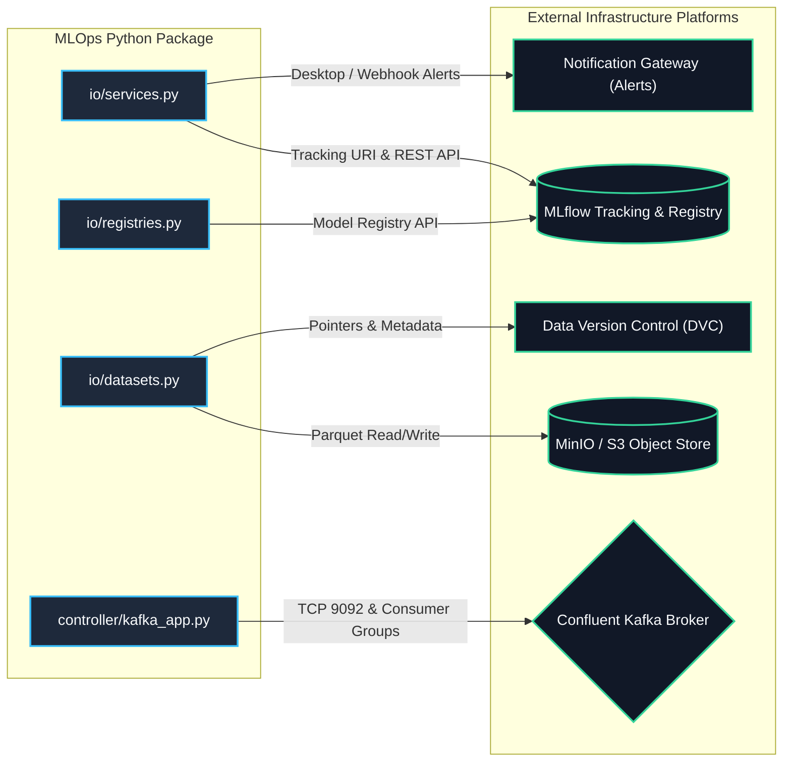

# Infrastructure Adapters & Platform Integrations

> **Purpose**: Document external connectivity adapters, storage systems, message brokers, and telemetry backends.

---

## 1. External Infrastructure Topology

---

## 2. Infrastructure Adapters Breakdown

### 1. MLflow Tracking & Registry (`io/services.py`, `io/registries.py`)
- **Protocol**: HTTP/REST and Python MLflow Client (`mlflow.tracking.MlflowClient`).
- **Configuration**: Injected via `osvariables.py` (`MLFLOW_TRACKING_URI`, `MLFLOW_REGISTRY_URI`).
- **Features**: Experiment isolation, metric logging (`MSE`, `RMSE`, `R2`), artifact versioning, and champion-challenger alias assignment.

### 2. Parquet Storage & DVC Integration (`io/datasets.py`)
- **Format**: Apache Parquet columnar binary with snappy compression.
- **Implementations**:
  - `ParquetReader`: Enforces optional row limits and extracts dataset lineage metadata.
  - `ParquetWriter`: Atomically writes DataFrames to persistent storage.
- **DVC Sync**: Datasets in `data/` are tracked using `.dvc` sidecar files committed to Git.

### 3. Kafka Streaming Broker (`controller/kafka_app.py`)
- **Client**: `confluent-kafka` (C-optimized `librdkafka` bindings).
- **Topology**: Input topic for incoming JSON requests; output topic for prediction responses.
- **Resilience**: Consumer poll loop with automatic partition assignment, graceful shutdown handlers, and error recovery.

### 4. Logging & Alerting Services (`io/services.py`)
- **`LoggerService`**: Configures Loguru sinks with structured serialization and level filtering.
- **`AlertsService`**: Dispatches system notifications upon pipeline failures.

---

> *Related: [Tactical Design](tactical_design.md) · [Production Operations](../operations/production_operations.md) · [Master Index](../index.md)*
