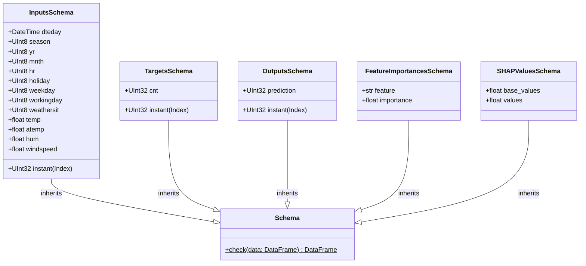

# Mission Data Model & Schema Contracts

> **Purpose**: Formal definition of tabular data contracts, feature schemas, prediction structures, and configuration schemas.

---

## 1. Pandera Tabular Schemas (`core/schemas.py`)

Every tabular dataset passing through a pipeline boundary is validated against strict Pandera `DataFrameModel` definitions:



---

## 2. API & Streaming Payloads (`controller/kafka_app.py`)

### `PredictionRequest`
Encapsulates an incoming payload submitted via HTTP POST `/predict` or consumed from Kafka:
```json
{
  "input_data": {
    "instant": [1],
    "dteday": ["2011-01-01 00:00:00"],
    "season": [1],
    "yr": [0],
    "mnth": [1],
    "hr": [0],
    "holiday": [0],
    "weekday": [6],
    "workingday": [0],
    "weathersit": [1],
    "temp": [0.24],
    "atemp": [0.2879],
    "hum": [0.81],
    "windspeed": [0.0]
  }
}
```

### `PredictionResponse`
Encapsulates the predicted target value returned to the client:
```json
{
  "result": {
    "prediction": [16]
  }
}
```

---

## 3. Cryptographic Signature Payload (`utils/signers.py`)

The `InferSigner` generates a SHA-256 hash attesting to prediction inputs and outputs:
```text
Signature: 8f9b3e1c2a4d5e6f7a8b9c0d1e2f3a4b5c6d7e8f9a0b1c2d3e4f5a6b7c8d9e0f
```

---

> *Related: [Security Architecture](../security/security_architecture.md) · [Core Schemas](../modules/regression_model_template/core/schemas.md) · [Master Index](../index.md)*
