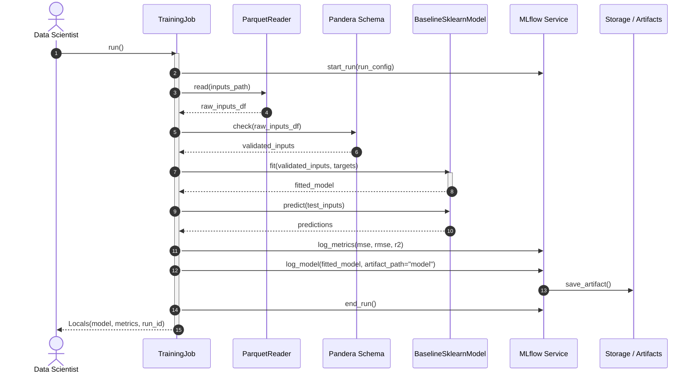
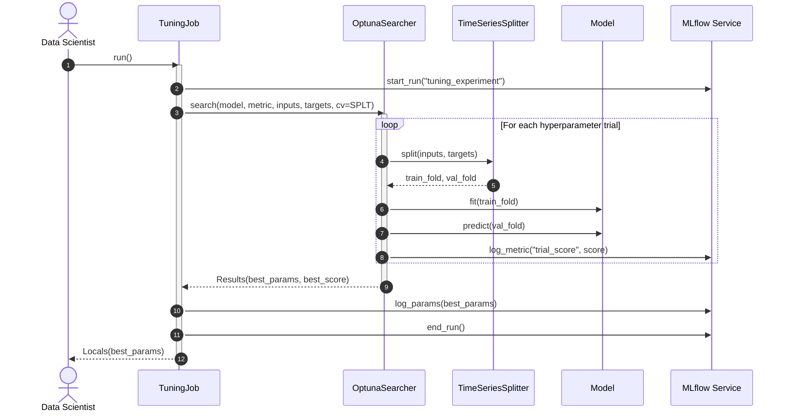
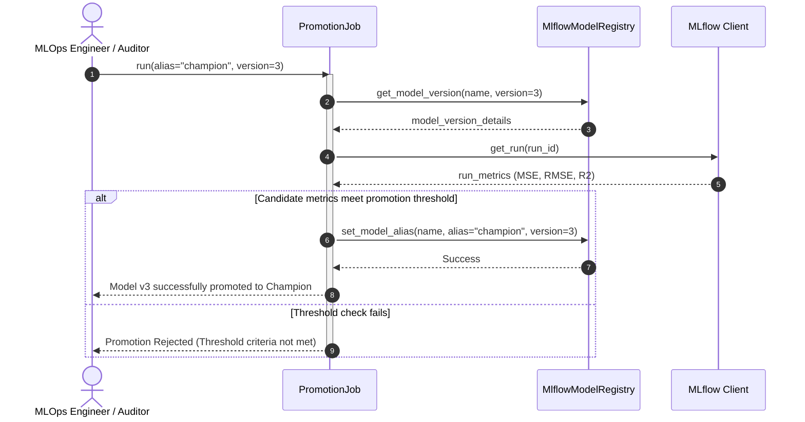
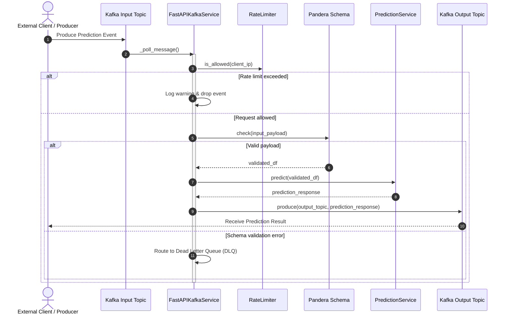

# Runtime Sequences & Execution Flows

> **Purpose**: Sequence diagrams illustrating the runtime interactions, message passing, and lifecycle flows across batch jobs and real-time streaming services.

---

## 1. Sequence 1: Batch Model Training & Registration

---

## 2. Sequence 2: Hyperparameter Tuning Flow

---

## 3. Sequence 3: Model Evaluation & Champion Promotion Gate

---

## 4. Sequence 4: Real-Time Kafka Streaming & Prediction Service

---

> *Related: [Agent Specifications](agent_specifications.md) · [Tactical Design](tactical_design.md) · [Master Index](../index.md)*
