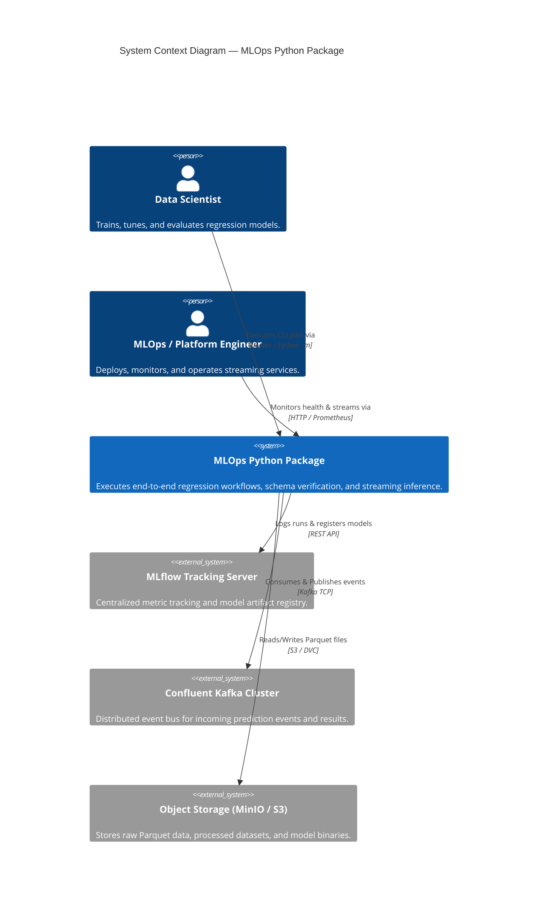
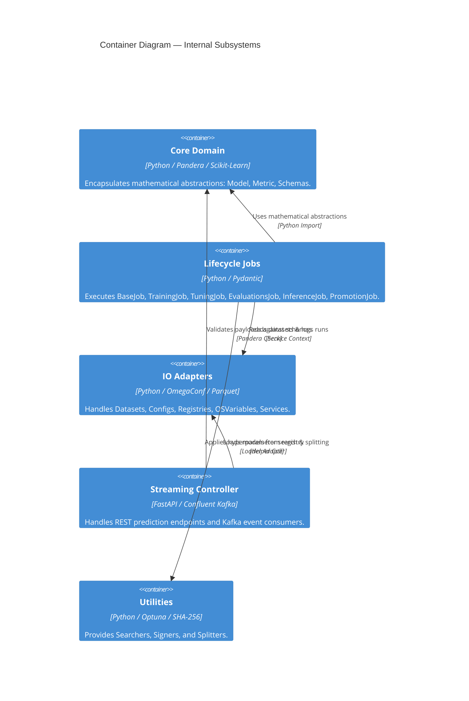
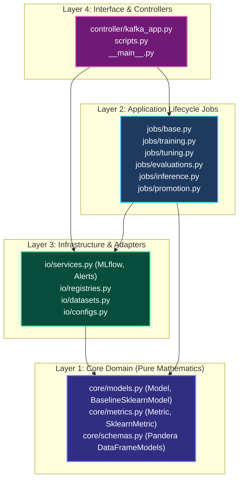

# Strategic Design & Onion Architecture

> **Purpose**: Detail the system boundary, high-level context, container interactions, and Onion Architecture layering of the MLOps Python Package.

---

## 1. C4 Level 1: System Context Diagram

---

## 2. C4 Level 2: Container Diagram

---

## 3. Onion Architecture Layers

The repository strictly enforces dependency inversion. Inner domain layers remain pure and completely oblivious to outer framework and infrastructure layers:

1. **Domain Layer (`core/`)**: Completely independent of database, framework, or network details. Defines abstract mathematical contracts for predictive estimators (`Model`), loss/scoring functions (`Metric`), and tabular structures (`Schema`).
2. **Application Layer (`jobs/`)**: Implements operational use cases. Each job subclasses `Job` (`jobs/base.py`), managing the setup, execution, and teardown lifecycle of distinct workflows.
3. **Infrastructure Layer (`io/`)**: Implements technology-specific adapters for external platforms, including MLflow tracking, OmegaConf YAML parsing, and Parquet file I/O.
4. **Interface Layer (`controller/`)**: Exposes streaming endpoints via Kafka and synchronous REST endpoints via FastAPI.

---

> *Related: [Tactical Design](tactical_design.md) · [Runtime Sequences](runtime_sequences.md) · [Master Index](../index.md)*
