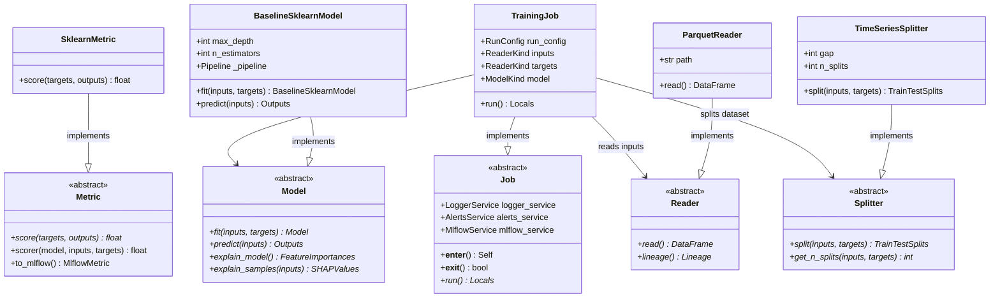

# Tactical Design & Design Patterns

> **Purpose**: Detail the micro-architectural design, design patterns, and C4 Level 3 component interactions across the codebase.

---

## 1. C4 Level 3: Component Diagram

---

## 2. Design Patterns in Action

### 1. Strategy Pattern
The Strategy pattern defines interchangeable algorithm families:
- **Models (`core/models.py`)**: Client code in `jobs/training.py` or `jobs/inference.py` consumes the abstract `Model` interface. Any estimator (Random Forest, Gradient Boosting, Deep Neural Network) can be substituted transparently.
- **Metrics (`core/metrics.py`)**: Metrics (`MSE`, `MAE`, `R2`) implement the `Metric` interface, providing unified scoring and MLflow threshold export.
- **Splitters (`utils/splitters.py`)**: `TrainTestSplitter` and `TimeSeriesSplitter` encapsulate distinct cross-validation partitioning algorithms.
- **Readers & Writers (`io/datasets.py`)**: `ParquetReader` and `ParquetWriter` isolate specific tabular serialization logic.

### 2. Context Manager / Template Method Pattern
The `Job` base class (`jobs/base.py`) implements the Python context manager protocol (`__enter__` and `__exit__`):
- `__enter__`: Automatically initializes `LoggerService`, `AlertsService`, and `MlflowService`.
- `__exit__`: Manages clean teardown, logs execution duration, and broadcasts failure notifications if unhandled exceptions occur.
- `run()`: The template method overridden by concrete jobs (`TrainingJob`, `TuningJob`, etc.).

### 3. Singleton Pattern
The `Singleton` metaclass in `io/osvariables.py` ensures that runtime environment settings (`Env`) are parsed exactly once from `.env` files and shared immutably across all worker threads.

---

> *Related: [Strategic Design](strategic_design.md) · [Data Model](mission_data_model.md) · [Master Index](../index.md)*
