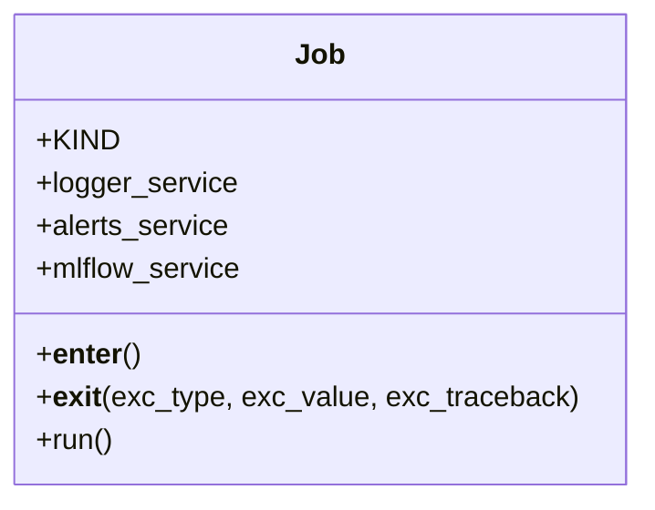
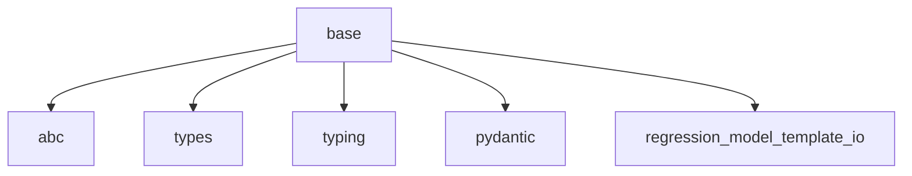

# base

Source File: `src/regression_model_template/jobs/base.py`

Base for high-level project jobs.

```mermaid
classDiagram
    class Job {
        +KIND
        +logger_service
        +alerts_service
        +mlflow_service
        +__enter__()
        +__exit__(exc_type, exc_value, exc_traceback)
        +run()
    }
```

```mermaid
flowchart TD
    base --> abc
    base --> types
    base --> typing
    base --> pydantic
    base --> regression_model_template_io
```
