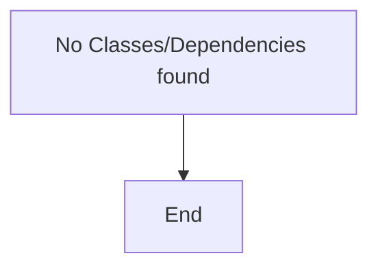

# controller_init

Source File: `src/regression_model_template/controller/__init__.py`

Predict the number of regression_model_template available.

```mermaid
flowchart TD
    A[No Classes/Dependencies found] --> B[End]
```
